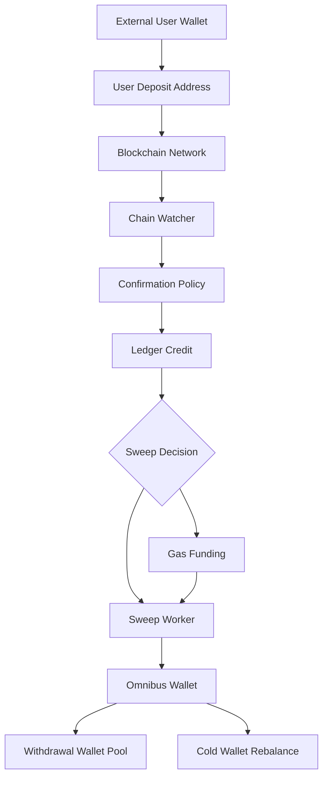
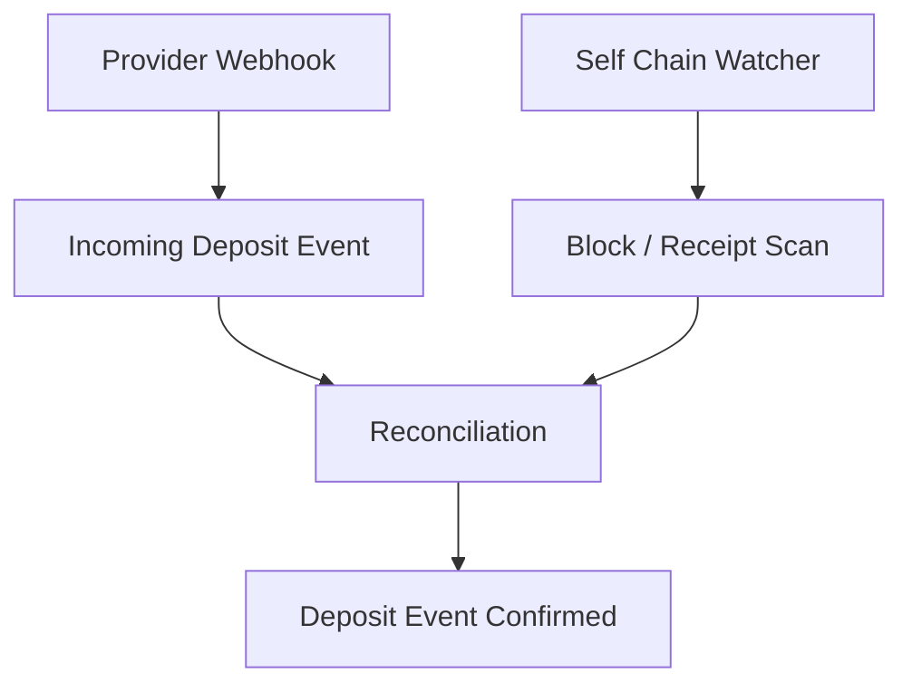
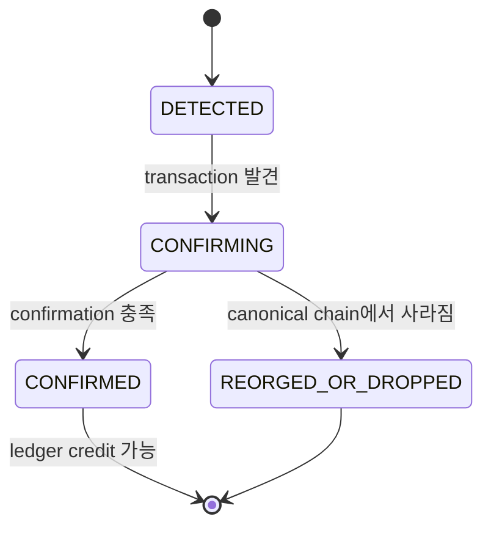

입금은 단순히 blockchain에서 transaction을 발견하는 일이 아닙니다.

프로덕션에서는 입금 감지, confirmation, 내부 ledger 반영, sweep, gas funding, reconciliation이 함께 움직입니다.

이 글은 입금과 sweep을 출금 설계의 준비 단계로 봅니다.

출금 처리량을 높이려면 출금 wallet pool만 보면 안 됩니다.

입금 자산이 어디에 모이고, 어떤 지갑에 유동성이 공급되는지도 같이 봐야 합니다.

## 큰 흐름



입금 흐름의 최종 목표는 세 가지입니다.

```text
사용자에게 정확히 credit한다.
운영 wallet으로 자산을 안전하게 모은다.
출금에 필요한 유동성을 준비한다.
```

## 1. Deposit Address 생성과 매핑

사용자가 입금하려면 asset과 chain에 맞는 deposit address가 필요합니다.

이 주소는 내부적으로 사용자와 연결됩니다.

```text
deposit_address
chain_id
asset_id
user_id
created_at
status
```

중요한 점은 deposit address가 사용자 소유 지갑이라는 뜻이 아니라는 것입니다.

수탁형 서비스에서는 provider 또는 우리 signer가 이 주소의 key를 관리합니다.

사용자는 이 주소로 입금할 수 있지만, 나중에 이 주소에서 직접 출금되는 것은 아닐 수 있습니다.

## 2. Chain Watcher

chain watcher는 우리 주소와 관련된 on-chain transaction을 찾습니다.

provider webhook을 받을 수도 있고, 자체 node/RPC/indexer로 읽을 수도 있습니다.

둘 중 하나만 믿기보다 두 경로를 비교하는 편이 안전합니다.



watcher가 확인해야 하는 값입니다.

```text
chain
asset
to address
amount
tx hash
block number
confirmation count
from address
token contract
event log
```

ERC-20 입금은 ETH transfer가 아니라 token contract event로 나타납니다.

따라서 native transfer와 token transfer 감지 로직이 달라집니다.

## 3. Confirmation Policy

입금을 발견했다고 바로 확정하면 안 됩니다.

chain별 finality와 reorg 가능성을 고려해야 합니다.



confirmation 기준은 chain별로 다릅니다.

EVM chain도 Ethereum mainnet, L2, sidechain의 리스크가 다를 수 있습니다.

이 기준은 나중에 운영 정책으로 명시해야 합니다.

## 4. Ledger Credit

confirmation이 충분하면 내부 ledger에 credit합니다.

```text
on-chain deposit confirmed
        |
        v
ledger entry 생성
        |
        v
user available balance 증가
```

ledger는 idempotent해야 합니다.

같은 tx hash와 log index를 두 번 처리해도 사용자 잔고가 두 번 증가하면 안 됩니다.

```text
unique key:
chain_id + tx_hash + log_index
```

native transfer라면 log index가 없을 수 있으므로 transaction index나 output index 같은 chain별 식별자가 필요합니다.

## 5. Sweep Decision

입금된 자산을 그대로 deposit address에 둘 수도 있지만, 운영상 보통 sweep을 검토합니다.

sweep은 입금 주소의 자산을 omnibus, withdrawal wallet, cold wallet 등으로 이동하는 작업입니다.

```text
Deposit Address
        |
        v
Sweep Worker
        |
        +--> Omnibus Wallet
        +--> Withdrawal Wallet
        +--> Cold Wallet
```

목적지는 정책으로 정합니다.

```text
소액 token
-> 일정 금액 이상 모이면 omnibus로 sweep

출금 수요가 큰 token
-> withdrawal wallet pool로 일부 보충

장기 보관 대상
-> omnibus를 거쳐 cold wallet로 이동
```

## 6. EVM Token Sweep과 Gas Funding

EVM에서 token을 sweep하려면 native gas token이 필요합니다.

예를 들어 Ethereum에서 USDC를 sweep하려면 deposit address에 ETH가 있어야 합니다.

```text
Deposit Address
USDC: 1,000
ETH: 0

USDC sweep 가능?
-> 불가능
-> ETH gas funding 필요
```

gas funding 흐름입니다.

```text
Gas Funding Wallet
        |
        v
Deposit Address
        |
        v
ERC-20 Sweep Transaction
        |
        v
Omnibus Wallet
```

provider별 용어는 다릅니다.

```text
Fireblocks Gas Station
-> gas funding

BitGo Gas Tank
-> gas funding

자체 signer
-> treasury gas wallet에서 직접 funding
```

## 7. Sweep 실패와 재시도

sweep은 자동으로 돌릴 수 있지만 실패할 수 있습니다.

실패 원인을 분리해야 합니다.

```text
INSUFFICIENT_GAS
-> gas funding 필요

LOW_TOKEN_BALANCE
-> sweep threshold 미만

PROVIDER_REJECTED
-> policy 또는 provider 오류

CHAIN_STUCK
-> 낮은 fee, mempool congestion

ALREADY_SWEPT
-> 중복 처리 방지
```

sweep transaction도 출금과 마찬가지로 idempotency key가 필요합니다.

```text
sweep_id = chain + deposit_address + asset + batch_time
```

정확한 key 설계는 chain과 provider API에 맞춰 조정합니다.

## 8. Reconciliation

입금과 sweep은 반드시 reconciliation이 필요합니다.

비교해야 하는 값입니다.

```text
on-chain deposit total
ledger credited total
deposit address remaining balance
sweep transaction total
omnibus received total
gas spent
provider transaction status
```

문제가 생기는 예입니다.

```text
watcher는 입금을 감지했지만 webhook은 누락됨
webhook은 왔지만 내부 처리 중 실패함
ledger credit은 됐지만 sweep이 실패함
sweep은 성공했지만 omnibus receipt 처리가 늦음
```

이런 상태를 사람이 수동으로 찾아서는 안 됩니다.

운영 시스템이 차이를 감지하고 알림을 줘야 합니다.

## 입금 흐름에서 출금 설계로 이어지는 점

입금은 출금과 직접 연결됩니다.

```text
입금이 omnibus에 모이지 않으면
-> withdrawal wallet pool에 리밸런싱할 자산이 부족함

gas funding이 느리면
-> ERC-20 sweep이 밀림

watcher가 늦으면
-> 사용자의 available balance 반영이 늦음

ledger가 부정확하면
-> 출금 가능 잔고 판단이 위험함
```

따라서 출금 nonce 관리만 따로 떼어 최적화하면 안 됩니다.

입금, sweep, ledger, liquidity가 같이 안정적이어야 합니다.

## 참고 자료

- [Fireblocks Developer Docs, Manage Deposits at Scale](https://developers.fireblocks.com/docs/manage-deposits-at-scale)
- [Fireblocks Developer Docs, Work with Gas Station](https://developers.fireblocks.com/docs/work-with-gas-station)
- [BitGo Developers, Fund Gas Tanks](https://developers.bitgo.com/guides/get-started/gas-tanks)
- [Kraken Support, Differences between a crypto exchange and a crypto wallet service](https://support.kraken.com/articles/115006441267-Does-Kraken-provide-a-wallet-service-)
