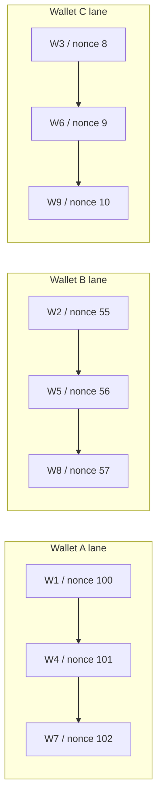

이더리움 입문 글에서 nonce는 계정이 보낸 트랜잭션 수와 연결된 값이라고 배웠습니다.

이번에는 운영 관점에서 봅니다.

수탁형 지갑에서 nonce는 단순한 필드가 아니라 출금 처리량을 제한하는 순서 제약입니다.

## nonce가 막히면 무엇이 막히나

EVM 체인에서 트랜잭션은 sender 주소의 nonce 순서를 따릅니다.

예를 들어 withdrawal wallet 주소가 하나 있다고 가정합니다.

```text
Withdrawal Wallet A

nonce 100 -> Tx A
nonce 101 -> Tx B
nonce 102 -> Tx C
```

`Tx A`가 낮은 gas fee 때문에 오래 pending 상태가 되면, 뒤에 있는 트랜잭션도 영향을 받을 수 있습니다.

운영자가 보기에는 출금 요청이 여러 개지만, 체인 입장에서는 같은 주소에서 나가는 순서 있는 트랜잭션입니다.

```text
사용자 출금 요청 100개
-> 같은 source address 1개
-> nonce lane 1개
-> 결국 줄 하나에 선다
```

그래서 단일 withdrawal wallet은 구조적으로 느려질 수 있습니다.

## pending과 latest

Ethereum JSON-RPC에는 `eth_getTransactionCount`가 있습니다.

이 메서드는 특정 주소가 보낸 트랜잭션 수를 반환합니다.

조회할 때 `latest`와 `pending` 같은 block tag를 사용할 수 있습니다.

```text
latest
-> 최신 확정 블록 기준

pending
-> pending transaction까지 고려한 기준
```

운영 시스템에서 주의할 점은 이것입니다.

```text
동시에 여러 worker가 같은 주소의 pending nonce를 조회한다
-> 같은 nonce를 읽을 수 있다
-> 둘 다 같은 nonce로 트랜잭션을 만들 수 있다
-> 충돌 또는 replacement 문제가 생긴다
```

따라서 hot path에서 매번 RPC로 nonce를 읽고 바로 쓰는 방식은 위험합니다.

우리 시스템은 source address별로 nonce lane을 하나의 큐처럼 다뤄야 합니다.

## source address 단위로 직렬화한다

nonce 관리의 기본 단위는 아래와 같습니다.

```text
chainId + sourceAddress
```

예를 들어 Ethereum mainnet의 wallet A와 Polygon의 wallet A는 다른 lane입니다.

같은 주소 문자열이라도 체인이 다르면 nonce 공간도 다르게 봐야 합니다.

```text
Ethereum / 0xWalletA
-> nonce lane A

Polygon / 0xWalletA
-> nonce lane B
```

같은 chain과 같은 sourceAddress 안에서는 순차 처리합니다.

```text
chainId=1, source=WalletA

출금 요청 1
-> custody provider transaction 생성 또는 자체 signer 요청
-> 상태 추적

출금 요청 2
-> 같은 lane에서 뒤에 대기
```

전체 처리량은 lane 수를 늘려서 올립니다.

```text
Wallet A lane
Wallet B lane
Wallet C lane
```

이 방식은 nonce를 직접 조작하는 전략이 아닙니다.

nonce 충돌이 생기지 않도록 업무 단위를 나누는 전략입니다.

## custody provider를 사용할 때의 경계

Fireblocks나 BitGo 같은 custody provider를 사용한다면, 우리 시스템이 모든 nonce를 직접 배정하지 않을 가능성이 큽니다.

provider가 source wallet에서 transaction을 만들고, 서명하고, 전송하는 흐름을 관리합니다.

그러면 우리 시스템의 책임은 달라집니다.

```text
custody provider 또는 자체 signer
-> 실제 transaction 생성, 서명, broadcast, status 제공

우리 백엔드
-> 어떤 wallet을 source로 쓸지 결정
-> 같은 wallet에 과도하게 몰리지 않게 queue 관리
-> idempotency key로 중복 요청 방지
-> stuck 상태일 때 wallet lane을 멈춤
-> 내부 ledger 상태를 안전하게 갱신
```

즉 우리가 직접 nonce 숫자를 들고 싸우기보다, wallet lane 단위로 흐름을 제어하는 쪽이 더 안전합니다.

## idempotency key

custody provider를 쓰든 자체 signer를 쓰든, 출금 요청에는 idempotency key가 필요합니다.

Fireblocks를 사용한다면 이 역할을 `externalTxId`가 맡을 수 있습니다.

Fireblocks 문서는 `externalTxId`를 중복 트랜잭션 제출을 피하는 데 사용할 것을 권장합니다.

다른 provider를 사용한다면 같은 역할을 하는 request id, client order id, idempotency key를 찾아야 합니다.

우리 출금 요청 ID를 idempotency key로 연결하면, API timeout이나 네트워크 오류가 나도 재시도할 수 있습니다.

```text
출금 요청 id = wd_123

provider create transaction
idempotencyKey = wd_123

응답 timeout
-> 같은 idempotencyKey로 조회 또는 재시도
-> 이미 생성된 transaction이면 중복 생성하지 않음
```

수탁형 지갑에서 중복 출금은 치명적입니다.

nonce 관리와 별개로 idempotency는 반드시 필요합니다.

## stuck transaction

EVM transaction은 gas fee가 낮거나 네트워크가 혼잡하면 오래 pending 상태가 될 수 있습니다.

Fireblocks 문서는 stuck transaction에 대해 RBF와 drop EVM transaction을 설명합니다.

다른 provider를 쓰거나 자체 signer를 쓰더라도 EVM에서 stuck transaction을 풀 때 같은 nonce로 더 높은 fee의 transaction을 보내는 RBF 개념은 여전히 중요합니다.

RBF는 같은 nonce의 새 트랜잭션을 더 높은 fee로 보내 기존 pending transaction을 대체하는 방식입니다.

```text
기존 Tx
nonce 100
fee 낮음
pending

대체 Tx
nonce 100
fee 높음
먼저 포함되도록 시도
```

drop EVM transaction은 같은 nonce로 0 value self-transfer를 보내 원래 전송을 취소하려는 방식입니다.

우리 운영 상태는 이렇게 나눌 수 있습니다.

```text
NORMAL
-> wallet lane 정상 처리

STUCK
-> 낮은 nonce transaction이 오래 pending
-> 같은 wallet lane 신규 배정 중단

BOOSTING
-> RBF로 fee를 올려 대체 시도

DROPPING
-> drop transaction으로 취소 시도

RECOVERED
-> 해당 nonce가 처리되거나 취소됨
-> wallet lane 재개
```

## wallet pool 처리 예시

출금 요청이 9개 들어왔다고 가정합니다.



각 wallet 안에서는 nonce 순서가 보존됩니다.

하지만 전체로 보면 세 줄이 동시에 움직입니다.

```text
단일 wallet
-> 한 줄

여러 wallet
-> 여러 줄
```

이게 EVM 출금 병렬화의 핵심입니다.

## 상태 모델 초안

출금 요청은 내부 ledger와 provider 또는 signer 상태를 함께 가져야 합니다.

예시 상태는 아래와 같습니다.

```text
REQUESTED
-> 사용자가 출금 요청

HELD
-> 내부 ledger에서 사용자 잔고 hold

ROUTED
-> withdrawal wallet 선택 완료

SUBMITTED_TO_PROVIDER
-> provider transaction 생성 요청 또는 자체 signer 요청 완료

BROADCASTING
-> provider 또는 자체 broadcaster가 네트워크 전송 중

CONFIRMING
-> txHash가 있고 confirm 대기

COMPLETED
-> 출금 완료

WAITING_FOR_GAS
-> gas token 부족으로 대기

STUCK
-> 낮은 nonce 또는 낮은 fee로 대기 장기화

FAILED_RETRYABLE
-> 재시도 가능 실패

FAILED_FINAL
-> 최종 실패, ledger hold 해제 또는 운영자 확인 필요
```

상태 이름은 나중에 실제 시스템에 맞춰 바꿀 수 있습니다.

중요한 것은 실패를 하나로 뭉개지 않는 것입니다.

gas 부족, stuck, API timeout, policy rejection은 서로 다른 원인입니다.

## 1차 운영 원칙

```text
nonce lane은 chainId + sourceAddress 단위로 본다.
같은 lane 안에서는 직렬화한다.
병렬성은 withdrawal wallet 수로 만든다.
API 재시도는 idempotency key로 안전하게 만든다.
stuck이 생긴 lane은 멈추고 다른 lane은 계속 처리한다.
낮은 nonce 문제가 풀리기 전까지 같은 wallet에 새 출금을 몰지 않는다.
```

이 설계는 빠르기보다 먼저 안전해야 합니다.

속도는 안전한 lane을 여러 개 두는 방식으로 올립니다.

## provider-managed와 self-managed 차이

nonce 관리 책임은 provider 선택에 따라 달라집니다.

```text
provider-managed nonce
        |
        +--> provider가 nonce 배정
        +--> provider가 일부 retry/replacement 지원
        +--> 우리는 wallet routing, queue depth, ledger, idempotency 관리

self-managed nonce
        |
        +--> 우리가 nonce reservation
        +--> 우리가 signed transaction 생성
        +--> 우리가 broadcast / replacement / recovery 관리
```

provider-managed라고 해서 아무 것도 안 해도 되는 것은 아닙니다.

출금 요청이 많이 들어오면 같은 source wallet에 queue가 쌓입니다.

provider가 nonce를 잘 배정하더라도, 낮은 nonce가 stuck되면 같은 wallet의 뒤쪽 transaction이 지연될 수 있습니다.

따라서 provider-managed 환경에서도 wallet lane 상태는 우리 운영 지표가 되어야 합니다.

## Chainstack 리서치에서 추가한 기준

Chainstack의 Ethereum nonce management 글은 우리 설계에 중요한 기준을 줍니다.

핵심은 아래입니다.

```text
pending nonce를 hot path에서 읽지 않는다.
가장 오래된 stuck nonce를 먼저 해결한다.
source address별 nonce tracker를 둔다.
nonce reservation은 durable storage에 남긴다.
여러 worker가 같은 signing key를 직접 공유하지 않는다.
private route와 L2 sequencer는 별도 failure mode로 본다.
```

따라서 우리 설계에서 nonce lane은 단순 queue가 아닙니다.

아래 상태를 갖는 운영 객체로 봅니다.

```text
chainId
sourceAddress
nextReservedNonce
oldestPendingNonce
oldestPendingAge
laneStatus
replacementAttempts
lastReconciledAt
```

자세한 리서치는 별도 문서에 정리합니다.

```text
research-chainstack-nonce-management.md
```

## nonce allocator가 필요해지는 경우

자체 signer를 쓰거나 provider가 raw signing만 제공한다면 nonce allocator가 필요합니다.

allocator는 단순히 `eth_getTransactionCount(..., "pending")`을 호출하는 코드가 아닙니다.

필요한 내부 상태입니다.

```text
chain_id
source_address
confirmed_nonce
next_reserved_nonce
reserved_nonce list
broadcasted transaction list
replacement relation
oldest_pending_age
lane_status
```

reservation 흐름은 아래처럼 봅니다.

```text
request withdrawal
        |
        v
select wallet lane
        |
        v
reserve nonce N
        |
        v
sign tx with nonce N
        |
        v
broadcast
        |
        +--> success: mark BROADCASTED
        +--> failed before broadcast: release or retry nonce N
        +--> unknown: keep reserved, reconcile
```

가장 위험한 상태는 `unknown`입니다.

서명 또는 broadcast 요청이 timeout 되었는데 실제로 transaction이 네트워크에 나갔는지 모르는 경우입니다.

이때 nonce를 바로 재사용하면 중복 또는 replacement 문제가 생길 수 있습니다.

## stuck lane 격리

stuck transaction이 생기면 전체 출금 시스템을 멈추면 안 됩니다.

멈춰야 하는 단위는 wallet lane입니다.

```text
Wallet A lane
nonce 10: stuck
nonce 11: waiting
nonce 12: waiting
status: PAUSED

Wallet B lane
nonce 31: confirming
nonce 32: ready
status: ACTIVE

Wallet C lane
nonce 8: confirming
nonce 9: ready
status: ACTIVE
```

router는 `PAUSED` lane을 새 출금 대상에서 제외합니다.

운영자는 Wallet A의 낮은 nonce transaction을 boost/drop/retry 대상으로 봅니다.

## pending view를 과신하지 않는다

Ethereum Execution API는 `pending` tag를 제공합니다.

하지만 pending view는 node가 보는 local mempool에 영향을 받습니다.

여러 node provider를 쓰면 서로 다른 pending 상태를 볼 수 있습니다.

그래서 프로덕션에서는 아래를 같이 봐야 합니다.

```text
provider transaction status
our nonce reservation DB
eth_getTransactionCount latest
eth_getTransactionCount pending
eth_getTransactionReceipt
block explorer 또는 secondary RPC
```

하나의 신호만으로 nonce를 확정하지 않습니다.

## RBF와 drop 판단

RBF는 같은 nonce로 더 높은 fee의 transaction을 보내 기존 transaction을 대체하려는 방식입니다.

drop은 같은 nonce로 0 value self-transfer를 보내 원래 출금을 취소하려는 방식입니다.

둘 다 운영 정책이 필요합니다.

```text
RBF 후보
-> destination과 amount 유지
-> fee만 높여서 출금 완료를 시도

drop 후보
-> 출금 자체를 취소해야 함
-> 같은 nonce로 self-transfer
-> 원 출금 요청은 실패/취소 처리 필요
```

drop은 단순한 기술 조치가 아닙니다.

사용자 출금 요청을 취소하거나 재생성하는 ledger 처리가 함께 필요합니다.

## 추가 검증 필요

```text
사용할 provider가 nonce를 직접 관리하는가?
provider가 wallet별 queue depth를 노출하는가?
provider가 stuck status를 명확히 주는가?
RBF/drop API가 있는가?
replacement tx hash와 원 tx hash 관계를 조회할 수 있는가?
self-managed signer를 쓸 경우 nonce reservation DB를 어느 저장소에 둘 것인가?
```

## 참고 자료

- [Ethereum.org, JSON-RPC API, `eth_getTransactionCount`](https://ethereum.org/en/developers/docs/apis/json-rpc/#eth_gettransactioncount)
- [Ethereum.org, Transactions](https://ethereum.org/en/developers/docs/transactions/)
- [Ethereum Execution APIs, `eth_getTransactionCount`](https://ethereum.github.io/execution-apis/api/methods/eth_getTransactionCount)
- [Circle Docs, Wallet Nonce Management](https://developers.circle.com/cpn/concepts/wallet-nonce-management)
- [Chainstack, Ethereum nonce management: preventing stuck transactions](https://chainstack.com/ethereum-nonce-management/)
- [BitGo Developers, Resolve Nonce Holes](https://developers.bitgo.com/docs/withdraw-nonce-holes)
- [Fireblocks Developer Docs, Create a new transaction](https://developers.fireblocks.com/api-reference/transactions/create-a-new-transaction)
- [Fireblocks Developer Docs, Boost/replace transaction parameters](https://developers.fireblocks.com/api-reference/transactions/create-a-new-transaction)
- [Fireblocks Developer Docs, Manage Withdrawals at Scale](https://developers.fireblocks.com/docs/manage-withdrawals-at-scale)
- [Coinbase Blog, A Dedicated Architecture for Solana at Coinbase](https://www.coinbase.com/blog/a-dedicated-architecture-for-solana-at-coinbase)
