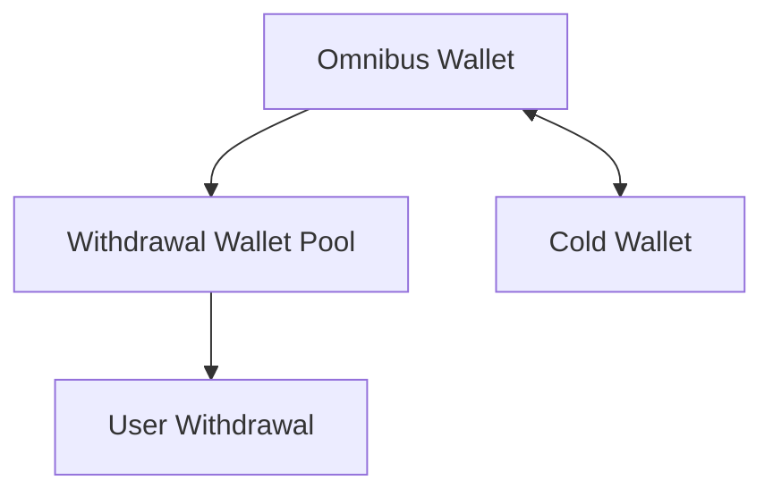
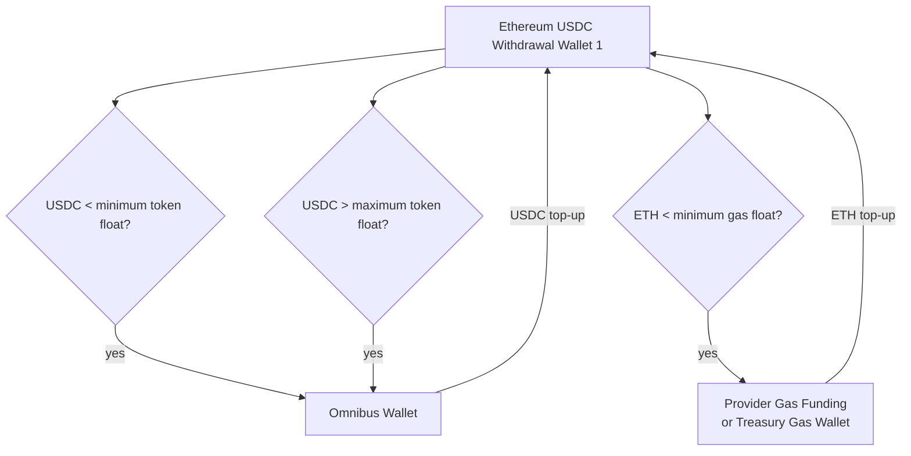

출금 nonce만 관리한다고 출금 시스템이 완성되지는 않습니다.

EVM 체인에서는 토큰을 보내더라도 gas는 native token으로 냅니다.

예를 들어 Ethereum에서 USDC를 보내려면 USDC만 있어서는 부족합니다.

```text
보낼 자산
-> USDC

수수료로 필요한 자산
-> ETH
```

Polygon에서 USDC를 보내려면 MATIC/POL 계열 gas token이 필요합니다.

Base에서 USDC를 보내려면 ETH가 필요합니다.

체인마다 gas token 재고가 따로 필요합니다.

## 두 종류의 부족

출금 wallet에서 부족할 수 있는 것은 두 가지입니다.

```text
출금 토큰 부족
-> 사용자가 받을 자산이 부족함

gas token 부족
-> 트랜잭션 수수료를 낼 자산이 부족함
```

둘은 다른 문제입니다.

USDC가 충분해도 ETH가 없으면 Ethereum USDC 출금은 못 나갑니다.

ETH가 충분해도 USDC가 없으면 USDC 출금은 못 나갑니다.

그래서 wallet 상태를 이렇게 나눠야 합니다.

```text
READY
-> token과 gas 모두 충분

LOW_TOKEN
-> 출금 토큰 부족

LOW_GAS
-> gas token 부족

DISABLED
-> stuck, policy, 운영자 조치 등으로 라우팅 제외
```

## gas funding

gas funding은 withdrawal wallet에 필요한 native token을 보충하는 운영 기능입니다.

벤더마다 이름과 방식은 다를 수 있습니다.

Fireblocks를 사용한다면 Gas Station이 이 역할을 할 수 있습니다.

BitGo 문서에서는 Ethereum gas tank를 별도로 설명합니다.

자체 signer를 쓴다면 treasury gas wallet에서 withdrawal wallet로 native token을 보내는 자동 보충 로직을 만들어야 합니다.

Fireblocks Gas Station에는 대표적으로 아래 설정이 있습니다.

```text
gasThreshold
-> 이 값보다 gas 잔고가 낮으면 충전 대상

gasCap
-> 충전 후 유지할 최대 gas 잔고

maxGasPrice
-> 자동 충전 트랜잭션이 사용할 수 있는 최대 gas price
```

우리 설계에서는 provider가 제공하는 gas funding 기능을 먼저 검토합니다.

다만 자동 gas funding이 모든 운영 문제를 없애지는 않습니다.

충전 트랜잭션도 on-chain transaction입니다.

네트워크 혼잡, 정책, 잔고 부족, 지원 체인 여부에 따라 지연될 수 있습니다.

## 체인별로 독립적으로 멈춘다

여러 체인을 운영할 때 중요한 원칙은 이것입니다.

```text
Ethereum gas 부족
-> Ethereum 출금만 대기

Polygon gas 정상
-> Polygon 출금은 계속 처리
```

특정 체인의 gas token 부족이 전체 출금 시스템을 멈추면 안 됩니다.

상태도 chain 단위로 봐야 합니다.

```text
ETH / USDC withdrawal pool
-> WAITING_FOR_GAS

Polygon / USDC withdrawal pool
-> READY

Base / USDC withdrawal pool
-> READY
```

사용자에게 보여주는 상태도 구분되어야 합니다.

```text
나쁜 표현:
출금 실패

더 정확한 표현:
Ethereum 네트워크 수수료 자산 보충 대기 중
```

내부 운영 상태에서는 `WAITING_FOR_GAS`처럼 실패가 아닌 대기 상태로 분리합니다.

## 리밸런싱

withdrawal wallet pool은 출금 속도를 위해 운영 float을 들고 있습니다.

하지만 너무 많은 자산을 hot wallet에 두면 보안 위험이 커집니다.

너무 적게 두면 출금이 자주 멈춥니다.

그래서 omnibus wallet과 withdrawal wallet 사이에 리밸런싱이 필요합니다.



리밸런싱 기준은 두 가지입니다.

```text
최소 기준
-> 이보다 낮으면 보충 필요

최대 기준
-> 이보다 높으면 omnibus 또는 cold로 회수 검토
```

예시입니다.



## wallet 선택에 gas를 포함한다

출금 라우터는 token balance만 보면 안 됩니다.

gas balance도 봐야 합니다.

```text
Wallet A
USDC 충분
ETH 부족
-> 선택하면 안 됨

Wallet B
USDC 충분
ETH 충분
pending depth 낮음
-> 선택 가능
```

라우터는 최소한 아래 값을 봅니다.

```text
tokenAvailable
gasAvailable
pendingDepth
stuckStatus
lastFailureReason
```

gas 부족 wallet을 선택하면 출금 요청이 바로 실패하거나 대기 상태가 됩니다.

가능하면 라우팅 단계에서 제외하는 것이 좋습니다.

## provider API timeout과 잔고 부족

custody provider에 transaction 생성 요청을 보냈는데 timeout이 날 수 있습니다.

이때 같은 출금을 새 요청으로 다시 만들면 중복 출금 위험이 있습니다.

그래서 출금 요청 ID를 idempotency key로 사용해야 합니다.

Fireblocks라면 `externalTxId`가 이 역할을 합니다.

```text
wd_1001
-> idempotencyKey = wd_1001
```

잔고 부족은 별도 상태로 둡니다.

```text
INSUFFICIENT_TOKEN_BALANCE
-> 출금 토큰 부족

INSUFFICIENT_GAS_BALANCE
-> gas token 부족

WAITING_FOR_REBALANCE
-> omnibus 또는 gas wallet에서 보충 대기
```

이 상태들은 최종 실패가 아닐 수 있습니다.

보충되면 다시 처리할 수 있습니다.

## 운영 알림

알림은 단순히 실패 건수만 보면 늦습니다.

아래 지표가 필요합니다.

```text
chain별 gas balance
wallet별 token balance
wallet별 pending depth
stuck transaction age
gas funding 성공/실패
rebalancing transaction 상태
idempotency 중복 reject 수
```

알림 예시입니다.

```text
Ethereum withdrawal pool gas coverage < 30분
Wallet A pending depth > 20
Wallet B oldest pending tx age > 10분
gas funding failed
Rebalance tx confirming > 20분
```

운영자가 보고 싶은 것은 "출금이 실패했는가"만이 아닙니다.

몇 분 뒤 실패할 가능성이 커지는지도 알아야 합니다.

## 참고 자료

- [Fireblocks Developer Docs, Work with Gas Station](https://developers.fireblocks.com/docs/work-with-gas-station)
- [Fireblocks Developer Docs, Configure Gas Station Values](https://developers.fireblocks.com/docs/configure-gas-station-values)
- [Fireblocks Developer Docs, Set Auto Fueling Property](https://developers.fireblocks.com/docs/set-auto-fueling-property)
- [Fireblocks Developer Docs, Create a new transaction](https://developers.fireblocks.com/api-reference/transactions/create-a-new-transaction)
- [BitGo Developers, Ethereum](https://developers.bitgo.com/coins/ethereum)
- [Kraken Support, Differences between a crypto exchange and a crypto wallet service](https://support.kraken.com/articles/115006441267-Does-Kraken-provide-a-wallet-service-)
