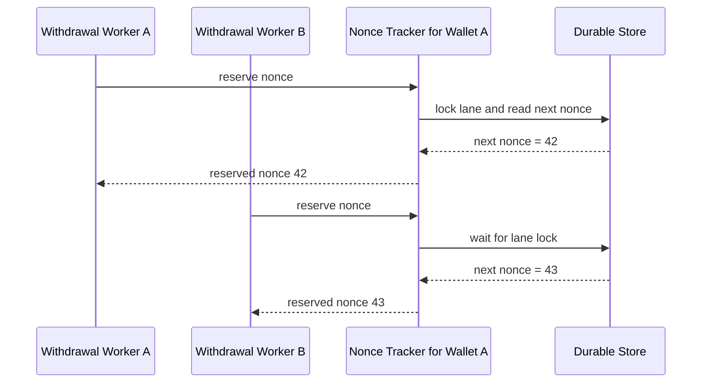

이 글은 Chainstack의 Ethereum nonce management 글을 따로 읽고 정리한 노트입니다.

이 자료는 provider 비교 자료라기보다, EVM nonce 관리 자체를 프로덕션 관점에서 설명합니다.

우리 수탁형 지갑 설계에서는 withdrawal wallet lane, signer service, stuck transaction 복구 설계와 직접 연결됩니다.

## 먼저 결론

Chainstack 글에서 가져갈 핵심은 아래입니다.

```text
같은 source address에서 낮은 nonce가 stuck 되면
뒤 nonce transaction은 모두 막힌다.

따라서 가장 오래된 stuck nonce를 먼저 해결해야 한다.
```

이 말은 단순하지만 중요합니다.

출금 요청이 100개 있어도 EVM 입장에서는 source address별 nonce 줄입니다.

```text
Wallet A
nonce 42 -> stuck
nonce 43 -> cannot land
nonce 44 -> cannot land
nonce 45 -> cannot land
```

`nonce 45`를 아무리 재시도해도 `nonce 42`가 해결되지 않으면 진행되지 않습니다.

우리 운영 시스템은 "가장 오래된 stuck nonce"를 찾아야 합니다.

## pending nonce를 hot path에서 읽으면 왜 위험한가

가장 단순한 방식은 transaction을 보낼 때마다 node에 물어보는 것입니다.

```text
eth_getTransactionCount(address, "pending")
```

하지만 Chainstack 글은 이 방식을 프로덕션 hot path에서 쓰면 위험하다고 설명합니다.

이유는 두 가지입니다.

### 1. pending view는 node마다 다를 수 있다

`pending`은 모든 네트워크의 절대 진실이 아닙니다.

node가 보는 mempool 상태입니다.

```text
RPC Node A
-> tx 42를 pending으로 봄

RPC Node B
-> tx 42를 아직 못 봄

Private relay
-> public mempool에는 tx가 보이지 않음
```

따라서 한 곳에서 보낸 transaction이 다른 RPC의 pending nonce에 반영되지 않을 수 있습니다.

이 상태에서 다음 nonce를 읽으면 충돌이 날 수 있습니다.

### 2. concurrent worker가 같은 nonce를 읽을 수 있다

두 worker가 동시에 nonce를 읽으면 둘 다 같은 값을 받을 수 있습니다.

```text
Worker A
-> get pending nonce = 42

Worker B
-> get pending nonce = 42

Worker A
-> nonce 42로 sign/broadcast

Worker B
-> nonce 42로 sign/broadcast
```

결과는 충돌입니다.

하나는 실패하거나, fee 조건에 따라 replacement처럼 동작할 수 있습니다.

수탁형 지갑 출금에서는 이런 불확실성을 허용하면 안 됩니다.

## local nonce tracker

Chainstack 글은 source account마다 하나의 nonce source of truth를 두라고 설명합니다.

우리 표현으로 바꾸면 아래와 같습니다.

```text
chainId + sourceAddress
-> nonce lane
-> local nonce tracker
-> durable reservation store
```

nonce tracker는 단순한 counter가 아닙니다.

동시 접근을 직렬화해야 합니다.



핵심은 worker가 직접 RPC에서 pending nonce를 읽고 결정하지 않는 것입니다.

worker는 nonce tracker에 요청합니다.

nonce tracker가 순서를 정합니다.

## durable storage가 필요한 이유

in-memory counter만으로는 부족합니다.

프로세스가 crash 될 수 있기 때문입니다.

```text
reserve nonce 42
        |
        v
sign transaction
        |
        v
process crash before DB update
```

이 경우 다음 프로세스가 무엇을 해야 할지 모를 수 있습니다.

따라서 reservation 상태는 durable storage에 남아야 합니다.

예시 상태입니다.

```text
RESERVED
-> nonce를 잡았지만 아직 broadcast 확인 전

SIGNED
-> signed transaction 생성됨

BROADCAST_ATTEMPTED
-> network 또는 provider에 전송 시도됨

BROADCASTED
-> tx hash 확인됨

CONFIRMED
-> receipt 확인됨

REPLACED
-> 같은 nonce의 replacement transaction이 확인됨

DROPPED
-> 같은 nonce의 cancel/drop transaction이 확인됨

UNKNOWN
-> timeout 또는 crash 때문에 상태 확인 필요
```

가장 위험한 상태는 `UNKNOWN`입니다.

이 상태에서 nonce를 바로 재사용하면 안 됩니다.

먼저 chain, provider, tx pool, receipt를 확인해야 합니다.

## signer service per account

Chainstack 글은 여러 process가 같은 signing key를 공유하면 외부 lock이 필요하고, 전용 signer service가 더 단순하고 안전할 수 있다고 설명합니다.

우리 설계에서는 이렇게 해석할 수 있습니다.

```text
나쁜 구조:
여러 withdrawal worker가 같은 wallet key로 직접 sign

더 나은 구조:
withdrawal worker는 signer service에 요청
signer service가 wallet lane별 nonce를 serialize
```

구조입니다.

```text
Withdrawal Workers
   |       |       |
   v       v       v
+-----------------------+
|   Signer Service      |
|                       |
| Wallet A Nonce Lane   |
| Wallet B Nonce Lane   |
| Wallet C Nonce Lane   |
+-----------+-----------+
            |
            v
     Blockchain / Provider
```

provider-managed signer를 쓰더라도 같은 관점을 유지할 수 있습니다.

provider가 실제 nonce를 배정하더라도, 우리 내부에서는 source wallet별 queue depth와 stuck 상태를 봐야 합니다.

## stuck transaction 감지

Chainstack 글은 transaction을 보낸 뒤 receipt를 기다리고, timeout이 지나면 stuck으로 판단하는 방식을 설명합니다.

수탁형 지갑에서는 timeout 기준이 chain별로 달라야 합니다.

```text
Ethereum L1
-> 수십 초에서 몇 분 기준으로 stuck 후보 판단

L2
-> 정상 상태라면 더 빠르게 포함될 수 있으므로 짧은 timeout

network congestion
-> fee market과 provider 상태까지 함께 확인
```

stuck 판단은 단순 시간만으로 하면 위험합니다.

함께 봐야 할 값입니다.

```text
oldest pending age
current base fee
maxFeePerGas / maxPriorityFeePerGas
provider status
secondary RPC receipt
replacement attempts
```

## replacement와 cancel

stuck transaction을 해결할 때는 같은 nonce를 써야 합니다.

다음 nonce를 올리는 것이 아닙니다.

```text
original tx
nonce 42
low fee
pending

replacement tx
nonce 42
higher fee
same intended action
```

취소가 필요하면 같은 nonce로 self-transfer를 보낼 수 있습니다.

```text
cancel tx
nonce 42
to = source wallet
value = 0
data = empty
higher fee
```

다만 cancel은 기술적으로 nonce를 해소하는 행위일 뿐입니다.

사용자 출금 요청은 별도로 실패/취소/재생성 처리해야 합니다.

ledger 처리 없이 cancel만 하면 내부 상태가 틀어집니다.

## private route와 pending nonce

Chainstack 글은 private relay나 private mempool을 쓰는 경우도 다룹니다.

private route를 사용하면 transaction이 public mempool에 보이지 않을 수 있습니다.

그 결과 일반 RPC의 pending nonce가 private transaction을 반영하지 않을 수 있습니다.

```text
Private Relay
-> tx 42를 받음
-> public mempool에는 안 보임

Public RPC
-> pending nonce가 42를 포함하지 않을 수 있음

다음 tx
-> nonce 42를 다시 잡을 위험
```

이 점은 local nonce tracker가 필요한 이유를 더 강하게 만듭니다.

private route를 쓰면 "node에게 물어보면 알겠지"가 더 위험해집니다.

## L2 sequencer

L2에서도 EVM account nonce 규칙은 유지됩니다.

다만 stuck의 원인이 다를 수 있습니다.

```text
Ethereum L1
-> fee 부족, mempool congestion, replacement 필요

L2
-> sequencer 장애, sequencer 지연, force inclusion 경로
```

따라서 L2 출금을 운영한다면 sequencer health도 모니터링해야 합니다.

```text
Base / Optimism / Arbitrum
-> sequencer uptime
-> L1 data availability 지연
-> force inclusion 가능 경로
```

우리 1차 범위가 EVM이라면 L1과 L2를 모두 같은 방식으로 묶기보다, chain profile에 timeout과 장애 기준을 둬야 합니다.

## 우리 설계에 반영할 점

Chainstack 글을 읽고 우리 문서에 반영할 설계 원칙입니다.

```text
1. hot path에서 pending nonce를 직접 읽고 결정하지 않는다.
2. chainId + sourceAddress마다 nonce source of truth를 둔다.
3. nonce reservation은 durable storage에 남긴다.
4. 여러 worker가 같은 key로 직접 sign하지 않게 한다.
5. 가능하면 signer service가 nonce lane을 직렬화한다.
6. 가장 오래된 stuck nonce를 먼저 해결한다.
7. replacement/cancel은 같은 nonce로 수행한다.
8. private route를 쓰면 pending view 불일치가 더 커질 수 있다.
9. L2는 sequencer health를 별도 운영 지표로 본다.
```

## 수탁형 지갑 문서와 연결

이 리서치는 아래 문서에 반영됩니다.

```text
EVM 출금 Nonce 관리
-> local tracker, durable reservation, oldest stuck first

출금 흐름
-> signer service, idempotency, provider timeout

운영 검증 항목
-> stuck lane, provider API latency, unknown state

프로덕션 인프라 체크리스트
-> signer service, durable storage, L2 sequencer health
```

## 추가 검증 필요

아직 확인해야 할 점입니다.

```text
사용할 provider가 nonce reservation 상태를 얼마나 노출하는가?
provider-managed nonce에서 local tracker를 어느 수준까지 둬야 하는가?
L2별 stuck timeout 기본값을 어떻게 잡을 것인가?
private route를 실제 출금에 사용할 가능성이 있는가?
replacement fee bump 정책을 자동화할 것인가?
```

## 참고 자료

- [Chainstack, Ethereum nonce management: preventing stuck transactions](https://chainstack.com/ethereum-nonce-management/)
- [Ethereum Execution APIs, `eth_getTransactionCount`](https://ethereum.github.io/execution-apis/api/methods/eth_getTransactionCount)
- [Ethereum.org, Transactions](https://ethereum.org/en/developers/docs/transactions/)
