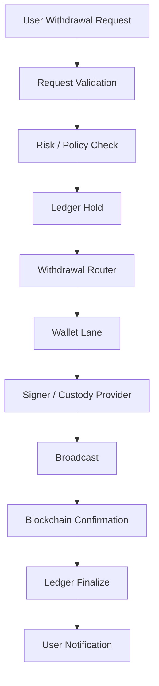
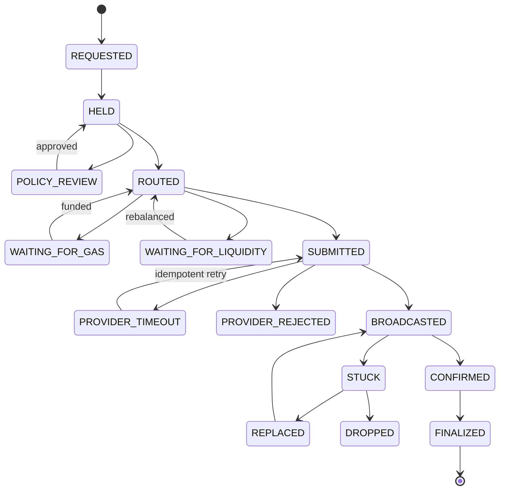

출금은 수탁형 지갑에서 가장 위험한 경로입니다.

입금은 자산이 들어오는 흐름이지만, 출금은 자산이 외부로 나가는 흐름입니다.

따라서 출금 시스템은 빠르기 전에 안전해야 합니다.

동시에 프로덕션에서는 출금 지연도 서비스 장애가 됩니다.

이 글의 목표는 출금 요청 하나가 어떤 단계를 지나야 하는지 명확히 하는 것입니다.

## 전체 흐름



이 흐름은 하나의 함수로 묶이면 안 됩니다.

각 단계는 실패 원인과 재시도 정책이 다릅니다.

## 1. Request Validation

출금 요청이 들어오면 먼저 형식을 확인합니다.

```text
chain
asset
amount
destination address
destination tag / memo
user id
request id
```

주소 검증은 chain별로 다릅니다.

XRP, Stellar, EOS 계열은 tag나 memo가 필요할 수 있습니다.

EVM 주소도 checksum, contract address, blocked address 여부를 봐야 합니다.

## 2. Risk / Policy Check

출금은 정책을 통과해야 합니다.

```text
사용자 인증 상태
출금 주소 등록 여부
신규 주소 hold 기간
AML / sanctions screening
Travel Rule 필요 여부
일일 한도
건별 한도
운영자 승인 필요 여부
```

Kraken 공개 문서에서도 새 withdrawal address를 추가하고 확인하는 흐름을 따로 안내합니다.

수탁형 지갑에서 주소 등록과 출금 승인 정책은 nonce 관리보다 앞에 있는 보안 계층입니다.

## 3. Ledger Hold

출금을 바로 확정하지 않고 ledger에서 hold를 잡습니다.

```text
available balance: 100 USDC
withdrawal request: 30 USDC

after hold:
available balance: 70 USDC
held balance: 30 USDC
```

hold가 필요한 이유입니다.

```text
동시 출금 중복 사용 방지
정책 승인 대기 중 잔고 보호
provider API timeout 후 재시도 가능
on-chain confirmation 전 상태 분리
```

hold 없이 transaction부터 보내면 실패 복구가 어려워집니다.

## 4. Withdrawal Router

router는 어떤 source wallet에서 출금할지 고릅니다.

EVM에서는 이 선택이 nonce lane 선택입니다.

```text
source wallet A
-> nonce lane A

source wallet B
-> nonce lane B

source wallet C
-> nonce lane C
```

router는 단순 round-robin만으로 충분하지 않을 수 있습니다.

최소한 아래를 봐야 합니다.

```text
token balance
gas balance
pending depth
oldest pending age
stuck status
provider availability
policy availability
```

## 5. Wallet Lane

wallet lane은 `chainId + sourceAddress` 단위의 순차 queue입니다.

```text
Ethereum / Wallet A
        |
        +--> nonce 100 / withdrawal-1
        +--> nonce 101 / withdrawal-2
        +--> nonce 102 / withdrawal-3

Ethereum / Wallet B
        |
        +--> nonce 55 / withdrawal-4
        +--> nonce 56 / withdrawal-5
```

같은 lane 안에서는 순서를 지킵니다.

다른 lane은 병렬로 움직입니다.

## 6. Signer / Provider

signer 계층은 transaction을 서명하고 전송 가능 상태로 만듭니다.

provider를 쓰면 provider API가 transaction 생성, 서명, broadcast, 상태 관리를 일부 담당할 수 있습니다.

자체 signer를 쓰면 우리가 nonce allocation, signing, broadcasting, replacement를 더 많이 책임져야 합니다.

```text
provider-managed
-> provider API create transaction
-> provider signer / policy
-> provider broadcast
-> provider status / webhook

self-managed
-> 우리 nonce allocator
-> 우리 signer
-> 우리 broadcaster
-> 우리 receipt watcher
```

provider를 쓰는 경우에도 내부 ledger와 idempotency는 우리 책임입니다.

## 7. Broadcast와 Confirmation

broadcast 후에는 tx hash가 생깁니다.

tx hash가 있다고 완료가 아닙니다.

```text
BROADCASTED
-> 네트워크에 전파됨

CONFIRMING
-> block에 포함됨, confirmation 대기

COMPLETED
-> 정책상 충분한 confirmation 확보
```

EVM에서는 transaction이 failed receipt를 가질 수도 있습니다.

따라서 receipt status도 봐야 합니다.

```text
receipt status = 1
-> EVM 실행 성공

receipt status = 0
-> transaction은 포함됐지만 실행 실패
```

ERC-20 transfer는 contract call이므로 성공/실패가 receipt에 반영됩니다.

## 8. Ledger Finalize

충분히 confirm되면 ledger hold를 finalize합니다.

```text
held balance: 30 USDC
        |
        v
settled withdrawal: 30 USDC
held balance: 0
```

실패하면 원인에 따라 다르게 처리합니다.

```text
policy rejected
-> hold release

provider timeout but status unknown
-> reconciliation 전 hold 유지

on-chain failed
-> fee 처리 확인 후 hold release 또는 partial adjustment

stuck
-> hold 유지, lane pause, RBF/drop 검토
```

## 장애 상태 전이



상태를 세밀하게 나누는 이유는 운영자가 다음 조치를 알기 위해서입니다.

`FAILED` 하나로 뭉개면 무엇을 해야 하는지 알 수 없습니다.

## idempotency

출금 요청 하나는 on-chain transaction 하나 또는 명시적인 replacement 흐름으로만 이어져야 합니다.

API timeout이 있어도 중복 출금이 나가면 안 됩니다.

```text
withdrawal_request_id = wd_1001
idempotency_key = wd_1001

create transaction
        |
        +--> success
        |
        +--> timeout
                |
                v
        query by idempotency_key
                |
                +--> found: 기존 transaction 추적
                +--> not found: 같은 key로 재시도
```

provider별로 이름은 다릅니다.

Fireblocks라면 `externalTxId`가 이 역할을 할 수 있습니다.

다른 provider라면 동일한 기능이 있는지 확인해야 합니다.

자체 signer라면 우리 DB의 unique constraint와 transaction state machine으로 보장해야 합니다.

## 출금 흐름의 핵심 기준

```text
ledger hold가 먼저다.
source wallet 선택은 nonce lane 선택이다.
provider API timeout은 중복 출금으로 이어지면 안 된다.
tx hash는 완료가 아니다.
webhook은 보조 신호이고, watcher/reconciliation이 필요하다.
stuck transaction은 해당 wallet lane만 멈춰야 한다.
```

## 참고 자료

- [Fireblocks Developer Docs, Manage Withdrawals at Scale](https://developers.fireblocks.com/docs/manage-withdrawals-at-scale)
- [Fireblocks Developer Docs, Create a new transaction](https://developers.fireblocks.com/api-reference/transactions/create-a-new-transaction)
- [BitGo Developers, Withdraw Overview](https://developers.bitgo.com/docs/withdraw-overview)
- [Circle Docs, Wallet Nonce Management](https://developers.circle.com/cpn/concepts/wallet-nonce-management)
- [Ethereum.org, Transactions](https://ethereum.org/en/developers/docs/transactions/)
