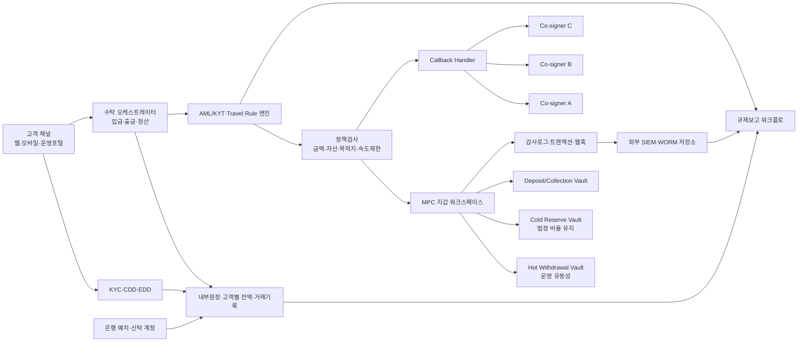
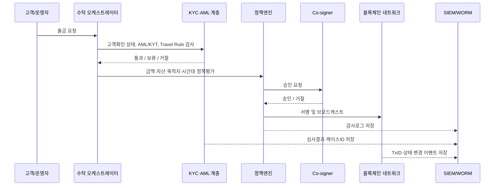

# 국내 가상자산 규제와 Fireblocks 기반 수탁형 지갑 설계 매핑 보고서

## Executive Summary

한국 수탁형 가상자산 사업자에게 현재 가장 강한 하드로는 2024년 7월 19일 시행된 이용자보호 체계와 특정금융정보법 체계이며, 핵심 의무는 고객자산 분리·동종동량 보유, 80% 이상 콜드월렛 보관, 핫월렛 노출분에 대한 보험·공제·준비금, 15년 거래기록 보존, AML/KYC/STR/트래블룰, 그리고 신고 전 ISMS 계열 인증 준비다. citeturn44search1turn43search6turn21search2turn38search0turn38search2turn20search0

urlFireblocksturn36search2 는 MPC-CMP 기반 Vault, 정책엔진, Co-signer, 감사로그, 웹훅, AML/KYT·Travel Rule 연계 기능을 제공해 기술통제의 상당 부분을 구현할 수 있지만, KYC 본인확인, FIU/KISA/FSS 보고, ISMS 인증 취득, 은행 예치·신탁, 보험·준비금, 장기 증적보존은 플랫폼 바깥의 조직·시스템·계약 통제가 필수라서 전반 평가는 대부분 “부분 대응”이다. citeturn29search2turn31search7turn29search1turn37search3turn37search0turn38search2turn40search10

이 보고서는 한국 내 VASP가 수탁형 지갑을 직접 운영한다는 가정 아래 작성한 기술·규제 분석이며, 법률 의견이 아니다.

## 전제와 해석 기준

이 보고서는 entity["country","대한민국","South Korea"] 내 가상자산사업자가 수탁형 지갑을 운영한다는 전제를 둔다. 실무 접점 기관은 주로 entity["organization","금융위원회","South Korea financial regulator"], entity["organization","금융감독원","South Korea financial supervisory service"], entity["organization","금융정보분석원","KoFIU, South Korea"], 그리고 entity["organization","한국인터넷진흥원","KISA, South Korea"] 이며, 법령 구속력은 법률·시행령·감독규정이 가장 높고, Q&A·보도참고·세부점검항목은 검사·인증·감독 실무를 반영하는 해석 자료로 보았다. citeturn38search5turn38search2turn43search9turn23search7

공개 웹에서 확인된 KISA의 VASP 전용 세부점검항목 최신 게시일은 2023년 7월 11일이었고, 2024~2026년 신규 VASP 전용 KISA 세부점검 공문·점검항목 업데이트는 이번 조사 범위에서 미확인이었다. 반면 일반 ISMS-P 자료실은 2024년 7월 24일에 세부점검항목을, 2026년 4월 21일에 신청양식을 업데이트했다. 따라서 보수적으로는 “일반 ISMS-P 최신자료 + VASP 전용 2023 세부점검항목”을 병행 준거로 잡는 편이 합리적이다. citeturn3view0turn5view0

## 국내 규제 출처 체계

현재 수탁형 지갑 설계에 직접 영향을 주는 국내 1차 규제 축은 크게 두 갈래다. 첫째는 이용자 자산 보호 축으로, 예치금 보호, 가상자산 분리보관, 콜드월렛 비율, 보험·준비금, 거래기록, 이상거래 상시감시를 다룬다. 둘째는 AML/CFT 및 신고 축으로, VASP 신고, ISMS, 실명계정 해당성, 고객확인, 의심거래보고, 트래블룰, 고객별 거래내역 분리관리, AML 조직·전산설비를 요구한다. 여기에 KISA ISMS 체계와 정보통신망법상 침해사고 신고 의무가 보안 증적 설계를 사실상 보강한다. citeturn44search1turn43search9turn38search0turn18search0turn21search2turn21search4turn38search2turn40search10

| 규제 출처 | 발행·시행일 | 적용범위 | 핵심 준수요구사항 요약 | 설계상 함의 |
|---|---|---|---|---|
| url가상자산 이용자 보호 등에 관한 법률 전문turn44search3 | 제정 2023-07-18 / 시행 2024-07-19 | 국내 VASP 전반 | 예치금·가상자산 분리보관, 동일 종류·수량 실질 보유, 보험·공제·준비금, 거래기록 보존, 이상거래 상시감시·통보의 상위법 틀을 정함 | 수탁원장 분리, cold/hot 운영정책, 장기보존, 시장감시 체계가 필수. citeturn44search1turn43search7turn20search8 |
| url가상자산 이용자 보호법 시행령turn44search11 | 제정 2024-07-02 / 시행 2024-07-19 | 이용자보호법 세부 | 보관비율·보안기준·거래기록 보존방식 등 하위 세부사항을 규정 | cold wallet 구조, 기록보존 포맷, 연간점검 증적 설계를 시행령 수준에 맞춰야 함. citeturn15view0turn44search8 |
| url가상자산업감독규정turn43search0 | 제정 2024-07-10 / 시행 2024-07-19 | 감독 실무 | 콜드월렛 80%, 보험·공제·준비금 기준, 예치금이용료, 보안성 평가기관 기준 등을 구체화 | 시스템 잔액 산식, 월평균 노출액 계산, 외부평가기관 대응 프로세스가 필요. citeturn43search6turn43search3turn14search2 |
| url금융위 Q&A 및 보도참고 자료turn23search7 / url시행 보도자료turn43search9 | 2024-07-17 / 2024-06-25 | 시행 해석 | 연간 보안점검 범위, 보험·준비금 산정방식, 인출·입출고 관리, 콜드월렛 의미 등을 해석 | 월별 스냅샷, 점검 스코프, 보고 일정 자동화가 필요. citeturn26view0turn43search2turn43search6 |
| url특정 금융거래정보의 보고 및 이용 등에 관한 법률turn44search9 | 현행 시행 2024-07-19 | VASP 신고·AML/CFT | 신고의무, 불수리 사유(ISMS·실명계정 해당성), 고객확인, 의심거래보고, AML 업무지침·조직·전산설비를 요구 | 수탁지갑은 AML/KYC 시스템과 결합되어야 하며, 신고·갱신 증적이 별도 관리되어야 함. citeturn38search0turn38search1turn18search0turn21search2 |
| url특금법 시행령 관련 개정 내용turn44search10 | 2024~2025 개정 반영 | 신고갱신·트래블룰·업무위탁 | 신고 유효기간 3년, FSS 심사 위탁, 실명계정 개시 기준, 트래블룰 기준금액(100만원) 등 | 신고 갱신캘린더, FSS 대응, 원화거래 여부에 따른 실명계정 법률검토가 필요. citeturn38search5turn20search0turn44search10 |
| url특정 금융거래정보 보고 및 감독규정 보완자료turn21search4 | 2024-06-27 개정·보완 | AML 실무 | 고객별 거래내역 분리 관리, 고객확인 완료 전 거래금지, 외부위탁 및 AML 책임체계 보완 | 내부원장은 고객별·지갑별·거래별 트레이서를 가져야 하고, 출금 파이프라인에 CDD 완료 플래그가 필수. citeturn21search4turn21search7 |
| urlKISA ISMS-P 안내 페이지turn38search2 | 상시 운영 | ISMS/예비인증 | 신규 VASP를 위한 ISMS 예비인증 제도를 명시 | 운영환경 반입 전 시험운영 단계부터 KISA 기준을 반영해야 함. citeturn38search2 |

KISA 관련 최신 공개 자료를 따로 보면, “규제 문서”와 “동향·해설 자료”를 구분해야 한다. VASP 전용 공개 세부점검문서는 2023년 버전이 최신으로 확인되었고, 2024~2026년에는 일반 ISMS-P 갱신자료와 디지털지갑·이용자보호 관련 해설 자료가 이어졌다. 즉, KISA 측 최신성은 “일반 보안인증 운영자료는 계속 갱신, VASP 전용 보충체크리스트는 공개 최신치가 2023”이라고 정리하는 것이 정확하다. citeturn3view0turn5view0turn28search0turn39view0

| KISA 관련 공개 자료 | 게시일 | 성격 | 이번 설계에서의 의미 |
|---|---|---|---|
| urlISMS-P 자료실 최신 업데이트 페이지turn1search10 | 2024-07-24 / 2026-04-21 | 일반 ISMS-P 운영자료 | 세부점검항목과 신청양식은 최신화되지만, VASP 전용 보충자료와는 구분해서 해석해야 함. citeturn5view0 |
| url가상자산사업자용 ISMS 세부점검항목turn2search1 | 2023-07-11 | VASP 전용 공개 점검항목 | 공개 웹 기준 최신 VASP 전용 세부점검 보충자료. 2024~2026 신규 VASP 전용 공개 후속 업데이트는 미확인. citeturn3view0turn5view0 |
| url가상자산 디지털지갑의 진화와 발전방향turn28search0 | 2026-02-03 | 심층보고서 | KISA가 디지털지갑 주제를 독립 심층보고서로 다루기 시작했다는 점에서, 지갑 구조·위협·산업 변화의 해설 참고자료로 활용 가능. citeturn28search0 |
| url2024년 상반기 사이버 위협 동향 보고서turn28search3 | 2024-09-06 | 사이버위협 보고서 | “가상자산 이용자 보호법, 사업자가 고려하여야 할 사항”을 별도 컬럼으로 다뤄, 법 시행 후 보안 실무 맥락을 연결하는 참고자료가 됨. citeturn39view0 |
| urlKISA Insight 2022 가상자산 지갑 유형 및 보안 요구사항turn2search9 | 2022-08-01 | 과거 KISA 해설 | 기술 요구사항 자체가 법은 아니지만, 키관리·접근통제·이상징후 탐지·백업·복구·거버넌스에 대한 KISA식 보안 관점을 보완해 줌. citeturn27view0 |

## 사업자 의무와 기술 요구사항

법령 문구는 기술 중립적이지만, 시행령·감독규정·Q&A·KISA 자료를 합치면 수탁형 지갑 운영자는 최소한 다음 다섯 묶음을 설계해야 한다. 첫째, 고객 자산 분리와 80% 이상 cold custody를 자동으로 증명하는 자산보호 체계. 둘째, KYC/CDD/EDD·STR·트래블룰을 거래 흐름에 삽입하는 AML/CFT 체계. 셋째, 다중승인·접근권한·감사로그·네트워크 분리·백업·복구를 포함하는 보안·내부통제 체계. 넷째, 연간 보안평가와 침해사고 보고를 위한 증적·보고 체계. 다섯째, 신고·갱신·ISMS·실명계정 해당성 검토를 위한 법무·규제 운영 체계다. citeturn44search1turn21search4turn26view0turn38search2turn40search10

특히 2024년 Q&A 기준으로 연 1회 보안평가는 사업연도 종료 후 2개월 이내에 실시되고, 결과 보고는 평가 종료 후 3개월 이내 제출이 요구된다. 점검 범위에는 계정 및 접근권한 라이프사이클, 네트워크 분리, 정보시스템 운영, 내부통제 등이 포함되며, 2026년부터는 대외 서비스에 대한 취약점 분석·평가와 침투테스트가 별도 항목으로 추가되어 공개 서비스면 보안성검증 부담이 더 커졌다. citeturn26view0turn14search2

| 범주 | 국내 요구사항 | 적용범위 | 설계상 의미 |
|---|---|---|---|
| 신고·갱신 | VASP는 FIU에 신고해야 하며, 신고 유효기간은 3년이고 갱신심사 자료를 다시 제출해야 한다. 신고 불수리 사유에는 ISMS 미보유가 포함되며, 원화거래형이면 실명확인 입출금계정 요건이 핵심이다. | 모든 국내 VASP, 다만 실명계정은 영업모델에 따라 조건부 | 설계문서, 보안정책, 외부평가기록, KYC/AML 체계, 은행연계 여부를 규제 패키지로 관리해야 한다. citeturn38search0turn38search1turn38search11turn44search10 |
| 고객 예치금 관리 | 예치금은 고유재산과 분리하여 예치 또는 신탁하고, 관리기관은 은행으로 정해졌다. | 고객 현금성 예치금을 받는 구조 | 가상자산 지갑만으로 끝나지 않고, 은행 신탁·예치 인터페이스와 일별 대사 설계가 필요하다. citeturn43search6turn38search8 |
| 이용자 가상자산 보관 | 고객 자산은 자기소유 자산과 분리하고, 이용자가 위탁한 동일한 종류·수량을 실질적으로 보유해야 한다. | 모든 수탁형 VASP | 온체인 월렛 구조와 별개로 고객별 잔액원장, 법인 자체자산 계정, 손익 계정이 명확히 분리되어야 한다. citeturn44search1turn13search3 |
| 콜드월렛 비율 | 시행령·규정은 이용자 가상자산 경제적 가치의 80% 이상을 콜드월렛으로 보관하도록 구체화했다. | 고객자산 전반 | hot/warm/cold 계층화, 자동 sweep, 80% 비율 대시보드가 필요하다. citeturn43search6turn43search2turn43search3 |
| 핫월렛 사고 대비 | 콜드월렛 보관분을 제외한 이용자 가상자산 경제적 가치 5% 이상에 대해 보험·공제 또는 준비금을 유지해야 하며, 최소금액 기준이 존재한다. | hot exposure가 있는 구조 | hot wallet 운영한도, 월평균 익스포저 계산, 보험·준비금 인터페이스를 별도 설계해야 한다. citeturn43search2turn43search3turn26view0 |
| 거래기록 | 거래내용 추적·확인이 가능하도록 기록을 15년간 보존해야 하고, 시행령안은 전산정보처리조직을 이용한 보존방식을 인정했다. | 모든 VASP 거래기록 | Fireblocks 로그만으로는 부족하고, WORM 성격 외부 저장소와 고객원장·증빙 매핑이 필요하다. citeturn44search1turn44search8 |
| AML/CFT·KYC | AML 업무지침, 조직·인력·전산설비, 고객확인, 미완료 고객 확인 전 거래제한, 고객별 거래내역 분리관리, 의심거래보고가 요구된다. | 특금법상 VASP | 출금 요청 전 KYC 상태와 AML verdict를 강제하는 트랜잭션 게이트가 필요하다. citeturn18search0turn21search2turn21search4turn38search8 |
| 트래블룰 | 100만원 이상 가상자산 이전 시 송·수신인 정보를 이전받는 사업자에게 제공해야 한다. | 외부 VASP 전송 | 지갑 주소만이 아니라 거래별 counterparties, IVMS101 데이터, 메시지 ID를 다뤄야 한다. citeturn20search0turn19search10 |
| 이상거래 상시감시 | 이상거래를 상시 감시하고 적절한 조치를 취하며 금융위 등에 통보하는 체계가 필요하다. | 시장감시 대상 영업 | 온체인·오프체인 이벤트를 모두 보는 모니터링 파이프라인과 케이스관리 시스템이 필요하다. citeturn38search7turn20search8 |
| 연간 보안평가 | 승인된 평가기관의 연 1회 보안성 평가가 요구되고, 계정·접근권한, 네트워크 분리, 시스템 운영, 내부통제가 주요 범위다. | 모든 수탁형 영업 | 로그, 정책버전, 변경기록, 접근권한 이력, 아키텍처 증적을 정형화해 두어야 한다. citeturn14search2turn26view0 |
| 침해사고 보고 | 정보통신서비스 제공자에 해당하면 침해사고 인지 후 24시간 이내 KISA 또는 과기정통부에 신고하고, 추가사실도 24시간 이내 보완해야 한다. | 정보통신서비스 제공자인 경우 | 보안사고 타임라인, 초기 영향평가, 신고 템플릿, 연락체계를 사전에 만들어 두어야 한다. citeturn40search10turn40search16 |

기술통제 관점에서 보면 “키관리·다중승인·접근통제·로깅·모니터링·복구·망분리”는 모두 직접 법조문으로 같은 해상도로 적혀 있지는 않다. 다만 연간 보안평가 항목, KISA ISMS/세부점검 구조, 정보통신망법상 침해사고 대응, 그리고 인접 금융보안 규정의 DMZ·접근통제·로그·백업 요구를 고려하면, 감독기관은 사실상 이 항목들을 “증적 가능한 운영통제”로 기대한다고 보는 편이 맞다. citeturn26view0turn38search2turn40search11turn40search0turn40search17

## urlFireblocksturn36search2 기능·아키텍처 평가

플랫폼 문서는 Direct Custody용 Vault Accounts와 end-user controlled Embedded Wallet을 명확히 구분한다. Vault는 workspace 안에 MPC 지갑을 두고 무제한 vault account로 고객·용도를 분리할 수 있지만, Embedded Wallet은 2-of-2 MPC 구조로 한 키 조각이 최종사용자 기기에 있고 “제3자 수탁자에 의존하지 않는” 모델이다. 따라서 한국형 수탁형 지갑 운영자가 고객자산을 대리 보관하는 기본 설계는 Embedded Wallet보다 Vault 중심이 자연스럽고, Embedded Wallet은 self-custody 옵션이나 보조 서비스에 더 가깝다. citeturn29search4turn30search7turn29search16

플랫폼의 강점은 기술통제 프리미티브가 비교적 명확하다는 점이다. Vault 계층, 정책엔진, Admin Quorum, whitelisted destinations, Co-signer, 감사로그, 웹훅, AML/KYT·Travel Rule 객체, customer reference ID, API 인증과 IP allowlist는 모두 공개 개발자 문서에서 확인된다. 반면 Key Link, Keys, 정책 편집기 일부, Cosigner 상태 조회 등은 beta로 표시되며, self-managed HSM environment 지원은 보안 백서/리포트 수준에서 언급되지만 공개 개발자 문서 기준의 상세한 GA 구축가이드는 제한적이므로 HSM 직접연계는 “부분 대응/세부 미확인”으로 보는 편이 안전하다. citeturn29search2turn33search5turn30search6turn31search7turn29search1turn32search14turn37search3turn37search0turn31search5turn36search1turn36search8turn31search18turn34search11

| 기능 축 | 기술 설명 | 설정 옵션·운영 절차 | 한계·주의 | 1차 근거 |
|---|---|---|---|---|
| Direct Custody Vault / MPC-CMP | Vault는 MPC-CMP 기반 wallet/address 관리 계층이며, private key는 하나의 완전체로 모이지 않는다. cold signing도 지원된다. | 고객별 또는 용도별 vault account를 만들고, 자산별 wallet과 deposit address를 생성한다. | 법적 분리보관 증명은 내부원장과 대사까지 필요하다. | url기능 개요turn29search2, url플랫폼 개요turn29search4, urlMPC-CMP 설명turn34search4 / citeturn29search2turn29search4turn34search4turn34search21 |
| 계정·주소 모델 | 각 vault account는 base asset당 1 wallet을 가지며, 자산 유형에 따라 여러 deposit address를 가질 수 있다. EVM 계열은 한 vault account 내에서 단일 deposit address가 여러 EVM 자산에 공유된다. | 고객별 segregated 구조 또는 omnibus 구조를 선택한다. UTXO·tag/memo 자산은 omnibus와 shared deposit address가 특히 중요하다. | EVM 주소 공유, account-based 자산의 단일 주소 특성, Solana·UTXO별 제약을 고려해 고객원장 로직을 따로 설계해야 한다. | urlDirect Custody Wallet 생성 가이드turn30search5 / citeturn30search5turn29search12 |
| 정책엔진·다중승인 | 정책은 금액, 기간, 승인자, 목적지, operation type 등에 따라 트랜잭션 한계와 승인 흐름을 정한다. Admin Quorum은 민감한 설정변경을 다중승인하도록 한다. | approval groups, user groups, Admin Quorum threshold, policy draft/publish 흐름을 설정한다. | 정책 V2 API는 beta 표기가 붙어 있다. 규제 필수통제는 beta 기능만 의존하지 않는 편이 낫다. | url정책 기능 설명turn30search1, urlAdmin Quorum 설명turn33search5 / citeturn30search1turn33search5turn33search7turn33search3turn33search14 |
| 목적지 화이트리스트·OTA | 기본적으로 외부 목적지 전송은 whitelist 선등록이 필요하며, 필요 시 One Time Address를 활성화할 수 있다. | external wallets, internal wallets, contracts를 선등록하고, 필요하면 OTA를 별도 승인 하에 켠다. | 운영환경에서는 OTA가 예외통제 없이 활성화되면 통제 약화 가능성이 크다. external wallet은 잔액 조회·source 사용이 불가하다. | url목적지 주소 관리 가이드turn30search6, urlOTA APIturn31search11 / citeturn30search6turn31search3turn31search11turn33search1turn33search4turn33search18 |
| Co-signer / Callback Handler | Co-signer는 고객 환경에 배치되어 자동승인·서명에 참여하며, SGX, AWS Nitro, GCP Confidential Space 등 신뢰실행/기밀컴퓨팅 계열 옵션이 있다. Callback Handler로 커스텀 비즈니스 로직을 넣을 수 있다. | 단일 또는 다중 Co-signer HA를 구성하고, callback server에서 AML/KYC/속도제한·case review를 선심사한다. | Co-signer 보안은 고객 네트워크와 운영책임에 크게 의존한다. 일부 관리 API는 beta이고, GCP Confidential Space는 단일 workspace 제약이 공개돼 있다. | urlCo-signer 아키텍처turn31search7, urlSGX Co-signerturn31search2, urlAWS Nitro Co-signerturn32search0, urlGCP Confidential Space Co-signerturn32search1 / citeturn31search7turn31search2turn32search0turn32search1turn32search10turn32search6turn32search2 |
| 감사로그·트랜잭션 추적·웹훅 | Admin/Non-Signing Admin 권한으로 audit logs를 조회할 수 있고, transaction history 및 웹훅으로 상태변화·입금·출금·계정 생성 이벤트를 스트리밍할 수 있다. | `/management/audit_logs`, `/transactions`, webhook endpoint를 외부 SIEM과 연결한다. | 플랫폼 내 로그 보존만으로 15년 보존을 충족한다고 보기 어렵다. 외부 WORM 저장소가 필요하다. | urlAudit Logs APIturn29search1, urlWebhooks v1turn32search14 / citeturn29search1turn29search9turn32search3turn32search14turn37search20 |
| AML/KYT·Travel Rule | AML 기능은 Chainalysis/Elliptic 등 연계와 screening policy를 지원하고, Travel Rule은 TRLink customer 객체와 IVMS101 데이터, policy를 지원한다. | `/screening/aml/policy_configuration`, `/screening/trlink/customers`, customerRefId 설정 API를 사용해 고객·거래를 연결한다. | 이것은 transaction screening과 message workflow이지, 국내 전자적 신원확인 자체를 대체하지 않는다. Notabene 등 외부 provider 의존도도 남는다. | urlAML 기능 설명turn37search5, urlTRLink customer APIturn37search0 / citeturn37search3turn37search5turn37search0turn37search10turn37search13turn37search20 |
| 백업·복구·HA | DRS는 signing device 상실 또는 서비스 중단 시 자산 접근을 보장하기 위한 백업·복구 절차를 제공하며, 다중 Co-signer HA도 지원한다. | DRS kit 보관, recovery runbook, Co-signer 이중화, 정기 failover drill을 운용한다. | wallet key 복구는 지원하지만, 전체 서비스 BCP/DR은 고객 인프라와 데이터계 층까지 별도 설계해야 한다. | urlDRS 개요turn30search0, urlCo-signer HA 구성turn31search15 / citeturn30search0turn31search15turn32search8 |
| API 보안 | API 인증은 JWT 서명 기반이고 private key는 고객 환경에 남는다. API key별 IP allowlist도 지원한다. | CSR 생성 후 API user를 만들고, 운영 IP만 허용한다. | 앱 계층, bastion, secret manager, HSM/TEE 운용은 여전히 고객 책임이다. | urlAPI Quickstartturn31search1, urlIP Allowlist 가이드turn31search5 / citeturn31search1turn31search6turn31search5turn31search17 |
| Key Link / Keys / HSM 관련 공개범위 | 공개 API에는 signing key·validation key·workspace MPC keys 조회가 있지만 모두 beta로 표시된다. 보안 백서는 self-managed HSM environments를 언급한다. | HSM 또는 외부 signing infra를 검토할 경우 beta 의존성, 공급자 확인, 별도 검증 문서를 받아야 한다. | 공개 개발자 문서 기준의 end-to-end HSM 통합 절차는 상세 미확인이다. 법정 HSM 증빙이 필요하면 별도 vendor attestation이 요구된다. | urlKey Link signing key APIturn36search0, urlKeys Beta APIturn36search1 / citeturn36search0turn36search1turn36search3turn36search8turn34search11 |

## 규제-플랫폼 매핑

아래 표의 “완전 대응”은 법률 의무 전체를 자동으로 충족한다는 뜻이 아니라, “플랫폼 경계 내부에서 해당 통제요소를 네이티브하게 제공한다”는 의미다. 반대로 “부분 대응”은 외부 서비스·내부원장·법무프로세스·규제보고·계약 통제가 더해져야 종합 준수가 성립한다는 뜻이고, “미대응”은 외부 시스템 없이는 해당 의무를 실질적으로 이행할 수 없다는 뜻이다.

| 규제/통제 항목 | 대응도 | 플랫폼 대응 기능 | 구체 근거 및 API/설정 | 남는 공백 |
|---|---|---|---|---|
| 신고 전 ISMS/예비인증 준비 | 부분 대응 | 정책, 감사로그, IP allowlist, Co-signer 보안체크리스트는 증적 후보가 될 수 있음 | `/management/audit_logs`, API IP allowlist, Co-signer security checklist를 통해 기술 증적 수집 가능. citeturn29search1turn31search5turn32search2 | 인증 심사 자체와 KISA 제출은 별도. VASP 전용 공개 세부점검 최신치는 2023-07-11이며, 최신 공개 후속 업데이트는 미확인. citeturn3view0turn38search2 |
| 고객자산/자기재산 분리 및 동종·동량 보유 | 부분 대응 | 고객별 vault account, omnibus 구조, balance API | 무제한 vault account로 고객·용도 분리 가능, `GET /vault/accounts`, `GET /vault/assets/{assetId}`로 잔액 조회 가능. citeturn29search4turn29search6turn30search5 | 법정 “동종·동량” 증명은 내부원장·대사·회계 시스템이 필요. citeturn44search1turn13search3 |
| 콜드월렛 80% 운영 | 부분 대응 | cold signing 지원, hot/warm/cold storage 모델, sweep 설계 | MPC-CMP는 cold signing을 지원하고, sweep/cold destination 설계 문서가 존재. citeturn34search4turn34search11turn30search10 | 80% 비율 계산, 월말/일별 증명, 예외처리 기록은 외부 통제 필요. citeturn43search6turn43search3 |
| 핫월렛 노출분 보험·공제·준비금 | 부분 대응 | 잔액 API로 hot exposure 산정 가능 | hot vault 잔액은 API로 집계 가능. citeturn29search6 | 보험·공제 가입, 준비금 적립, 최소금액 충족은 외부 재무·계약 영역. citeturn43search2turn43search3turn26view0 |
| 출금 승인통제·역할분리 | 완전 대응 | 정책엔진, approval groups, Admin Quorum, whitelist | 다중승인, 한도·목적지·operation 기반 정책과 Admin Quorum을 네이티브 제공. citeturn30search1turn33search5turn33search7turn30search6 | 회사 규정과 인사권한표는 별도 문서화 필요. |
| 플랫폼 계정·API 접근통제 | 완전 대응 | 역할 분리, JWT+CSR, API key IP allowlist | JWT 서명 인증, CSR 등록, IP allowlist 지원. citeturn31search1turn31search6turn31search5turn31search17 | 앱·DB·관제망까지 포함한 전사 IAM은 외부 통제 필요. |
| 목적지 화이트리스트 통제 | 완전 대응 | external/internal wallets, contracts, OTA on/off | 기본은 whitelist-only이며 OTA는 별도 활성화가 필요. `external_wallets`, `internal_wallets`, `contracts`, `/management/ota`. citeturn30search6turn31search11turn33search1turn33search18turn33search12 | 운영 예외 프로세스와 ticket-based 정당성 증빙은 외부가 담당. |
| 플랫폼 감사추적 생성 | 완전 대응 | audit logs, transaction history, webhooks | `/management/audit_logs`, transaction history, webhook events로 상세 추적 가능. citeturn29search1turn29search9turn32search14turn37search19 | 외부 장기보존, 케이스관리 연계는 별도. |
| 법정 15년 기록보존 | 부분 대응 | 감사로그·트랜잭션·웹훅 데이터를 외부 저장소로 송출 가능 | audit logs + transaction/webhook feed는 장기보존 파이프라인의 소스가 될 수 있다. citeturn29search1turn32search14turn37search20 | 15년 WORM 보존, 고객원장 결합, 검색성은 외부 스토리지·아카이브가 필수. citeturn44search1turn44search8 |
| KYC 본인확인 / CDD / EDD | 미대응 | customerRefId 연결, AML 고객 참조 정도만 지원 | vault/internal/external wallet에 customerRefId를 부여할 수 있다. citeturn37search7turn37search18turn37search21 | 전자적 신원확인, 실명확인, 서류검증, EDD는 별도 KYC 시스템이 필요. citeturn18search0turn21search4 |
| AML/KYT 거래 스크리닝 | 부분 대응 | AML policies, Chainalysis/Elliptic 연계, BYORK manual verdict | AML screening policy와 manual review, callback 기반 제3자 AML 연계 지원. citeturn37search5turn37search2turn37search9turn37search11 | 국내 STR 기준·오탐처리·case escalation·보존정책은 내부 AML 조직이 담당. citeturn21search2turn38search8 |
| STR 제출 | 부분 대응 | 의심 이벤트 탐지 보조만 가능 | screening 결과와 transaction object에 compliance 메타데이터를 연결 가능. citeturn37search1turn37search20 | FIU 정식 STR 제출, 판단 책임, 보고기록 관리는 외부 AML 시스템과 인력이 필요. citeturn21search2turn21search7 |
| Travel Rule | 부분 대응 | TRLink customer, Travel Rule policy, message ID 연결 | `/screening/trlink/customers`, travelRuleMessageId, policy 지원. citeturn37search0turn37search8turn37search10turn37search20 | 국내 counterparty routing, 보존, 실패재시도, 법정 threshold 통제는 추가 구현 필요. citeturn20search0turn19search10 |
| 연 1회 보안평가 대응 증적 | 부분 대응 | 정책·로그·코시그너 배치·네트워크 룰 증적 수집 가능 | Co-signer security checklist, audit logs, policy artifacts를 평가기관에 제시 가능. citeturn32search2turn29search1turn33search3 | 승인 평가기관 점검, 침투테스트, 외부 서비스 스캔·개선조치는 별도. citeturn26view0turn14search2 |
| 네트워크 분리·DMZ·로컬 인프라 통제 | 부분 대응 | customer-hosted co-signer, callback server, API IP allowlist | Co-signer는 고객 환경에 배치되고 네트워크 룰 구성 권고가 있다. citeturn32search18turn32search13turn31search5 | 한국 규제상 DMZ, 망분리, bastion, 운영망 분리는 고객 인프라에서 구현해야 한다. citeturn40search11turn26view0 |
| 백업·복구·업무연속성 | 부분 대응 | DRS, 다중 Co-signer HA | DRS와 HA 문서가 공개돼 있다. citeturn30search0turn31search15turn32search8 | 원장·KYC·AML·신고시스템까지 포함한 전체 BCP/DR은 별도 설계가 필요하다. |
| 침해사고·감독당국 보고 제출 | 미대응 | 탐지·증적 수집 보조만 가능 | webhooks, logs, monitoring feed는 초기 인지에 유용하다. citeturn32search14turn29search1 | KISA 24시간 신고, FSS/FSC 통보, 대외 커뮤니케이션은 외부 incident response 프로세스가 필요. citeturn40search10turn20search8 |

## 준수 설계 권고와 통제 아키텍처

권고의 핵심은 “법적 의무를 기술기능에 매핑하되, 준수 책임이 남는 경계는 명시적으로 플랫폼 바깥에 둔다”는 것이다. 즉, 고객자산 보관과 서명은 MPC Vault 계층에서, 고객확인·AML·트래블룰은 규제 컴플라이언스 계층에서, 장기보존과 보고는 증적·규제운영 계층에서 분리해야 한다. 이 분리가 있어야 콜드월렛 80% 유지, 고객별 잔액 대사, KYC 미완료 거래 차단, 외부 SIEM/WORM 보존, 침해사고 24시간 신고 같은 요구를 한 번에 충족시키기 쉽다. citeturn43search6turn21search4turn40search10turn29search4turn31search7

| 설계 축 | 권고 | 이유 |
|---|---|---|
| 지갑 계층화 | Deposit/Collection Vault, Hot Withdrawal Vault, Cold Reserve Vault를 분리하고, 고객 규모가 큰 경우 고객별 독립 vault account를 권고 | 80% cold ratio와 hot exposure 계산, 고객별 대사, 사고범위 최소화에 유리. citeturn43search6turn30search5turn29search4 |
| 승인 정책 | 운영환경에서는 whitelist-only를 기본값으로 두고, OTA는 비상 예외 절차에서만 제한적으로 허용 | 목적지 통제와 내부자 리스크 억제에 가장 직접적. citeturn30search6turn31search3turn31search11 |
| 서명 인프라 | 고객 통제형 Co-signer를 최소 2개 이상 별도 신뢰영역에 두고, Callback Handler에서 AML/KYC/정책 위반 시 자동 거절 | 네트워크 분리와 승인 자동화의 균형을 맞출 수 있음. citeturn31search7turn32search10turn32search6 |
| 증적 보존 | audit logs, transactions, webhooks를 외부 SIEM과 불변성 저장소로 이중 적재 | 플랫폼 로그 생성과 법정 15년 보존은 별개이기 때문. citeturn29search1turn32search14turn44search1 |
| 규제 인터페이스 | 은행 예치/신탁, 보험·공제/준비금, FIU STR, KISA/FSS 신고를 전담하는 규제운영 모듈을 분리 | 지갑 플랫폼만으로 해결되지 않는 의무를 사전에 구조화해야 함. citeturn43search6turn21search2turn40search10 |

아래 아키텍처는 “플랫폼 안에서 가능한 것”과 “국내 규제 때문에 바깥에서 반드시 해야 하는 것”을 분리한 권고안이다. 특히 고객확인·AML·트래블룰·내부원장·보고는 지갑 시스템 앞뒤에 붙이는 편이 아니라, 서명 허가의 전제 계층으로 강제해야 한다. citeturn21search4turn37search9turn37search10turn31search7

출금 파이프라인은 아래처럼 “KYC 완료 → AML/KYT/트래블룰 → 정책평가 → Co-signer 승인 → 브로드캐스트 → 증적저장” 순서로 직렬화하는 것이 좋다. 한국 규제는 미완료 고객확인 전 거래 제한과 거래별 추적 가능성을 요구하므로, 승인 이전 단계에서 compliance verdict가 빠지면 통제가 무너진다. citeturn21search4turn20search0turn37search2turn37search20

## 운영·감사 체크리스트와 잔여 리스크

운영 체크리스트는 “법정 의무를 주기화”해야 의미가 있다. 하루 단위로는 cold ratio, 고객별 잔액대사, 미확인 고객 출금 시도, whitelist/OTA 예외, webhook 누락을 보아야 하고, 월 단위로는 핫월렛 노출액과 보험·준비금 기준, 계정권한 재검토, 로그 보존 완전성을 확인해야 한다. 분기 단위로는 DRS·HA·사고보고 모의훈련을, 연 단위로는 승인기관 보안평가와 ISMS 감사를 묶는 편이 효율적이다. citeturn26view0turn44search1turn30search0turn31search15

| 주기 | 점검 항목 | 반드시 남길 증적 | 관련 근거 |
|---|---|---|---|
| 일일 | 콜드월렛 비율 80% 이상 유지 여부, 고객별 잔액과 온체인 보유량 대사, KYC 미완료 고객 출금 차단 여부 | cold ratio 대시보드, 고객별 원장-온체인 대사 리포트, blocked withdrawal 로그 | citeturn43search6turn21search4turn44search1 |
| 일일 | AML/KYT·Travel Rule 예외 케이스, webhook 누락, failed transaction 재처리 | case queue, travel rule message ID, webhook delivery 모니터링, 재처리 이력 | citeturn37search10turn37search20turn32search14 |
| 주간 | whitelist/OTA 예외, 정책 변경, Admin Quorum 변경, privileged user diff | whitelist diff, 정책 버전 hash, quorum 변경승인 로그 | citeturn30search6turn31search11turn33search5turn29search1 |
| 월간 | hot wallet 노출액 월평균 계산 및 보험·준비금 적정성 점검 | 월평균 잔액 산식, 보험증권/준비금 증빙, hot vault exposure report | citeturn43search3turn26view0 |
| 분기 | DRS 복구 테스트, 다중 Co-signer failover, 침해사고 24시간 신고 모의훈련 | 복구 리허설 결과, failover report, 신고 drill 결과서 | citeturn30search0turn31search15turn40search10 |
| 반기 | 접근권한 재인증, API IP allowlist 재검토, 운영망/DMZ 분리 상태 점검 | access review sign-off, allowlist 내역, 네트워크 다이어그램과 변경기록 | citeturn31search5turn40search11turn26view0 |
| 연간 | 승인기관 보안평가 수행 및 결과 보고, ISMS 유지·갱신 준비 | 평가기관 보고서, 개선조치 evidence, ISMS 심사 자료 | citeturn26view0turn3view0turn38search2 |
| 이벤트 발생 시 | 신고사항 변경, 영업모델 변경, 사고 발생, 신규 자산 상장/지원 | 변경신고 패키지, incident timeline, 신규자산 리스크평가서 | citeturn38search11turn40search10turn30search1 |

잔여 리스크는 기술 부족보다 “경계 오판”에서 더 자주 발생한다. 즉, 플랫폼이 제공하는 네이티브 통제를 법적 준수 완료로 오해하면 가장 위험하다. 국내 규제상 남는 진짜 리스크는 인증·보고·은행·보험·고객확인·장기보존·망분리처럼 대부분 플랫폼 외부의 운영 영역에 있다. citeturn38search2turn21search2turn40search10turn43search6

| 잔여 리스크 | 현재 상태 | 위험도 | 권고 완화조치 |
|---|---|---|---|
| KISA VASP 전용 공개 세부점검항목의 최신성 공백 | 공개 웹 기준 최신 VASP 전용 보충자료는 2023-07-11이고, 2024~2026 신규 후속 공개자료는 미확인 | 중간 | 일반 ISMS-P 최신 자료와 2023 VASP 세부점검항목을 함께 컨트롤 매트릭스로 운영하고, 심사 전 KISA 확인 질의 절차를 둔다. citeturn3view0turn5view0 |
| beta 기능 의존 | Policy V2, Keys, Key Link, 일부 Cosigner API는 beta | 중간~높음 | 법정 필수통제는 GA 기능으로 설계하고, beta는 보조 자동화로만 사용한다. vendor release note와 계약상 지원범위를 별도 확보한다. citeturn33search3turn36search1turn36search8turn31search18 |
| KYC/EDD/실명확인 미내장 | 플랫폼은 customerRefId 등 연결만 제공, 본인확인은 미내장 | 높음 | 국내 eKYC/신분증·계좌실명·법인문서 검증 모듈을 별도 도입하고, 출금 전 CDD 완료 flag를 강제한다. citeturn37search7turn21search4turn18search0 |
| STR·KISA/FSS/FIU 보고 미내장 | 탐지 보조는 가능하나 제출·대외보고는 외부 프로세스 필요 | 높음 | 케이스관리 시스템, 신고 템플릿, 법무·컴플라이언스 on-call 체계, 24시간 incident runbook을 별도 구축한다. citeturn21search2turn40search10turn20search8 |
| 은행 예치/신탁 및 보험·준비금 의존성 | 지갑 플랫폼 외부 계약·정산 이슈 | 높음 | 은행·보험사·준비금 계정과 daily recon 인터페이스를 만들고, 월평균 노출액 산출을 자동화한다. citeturn43search6turn43search3turn26view0 |
| 네트워크 분리·로컬 보안 증적 부족 | Co-signer가 고객 환경에 배치되므로 운영수준이 곧 준수수준이 됨 | 중간~높음 | 운영망/DMZ/관리망을 분리하고, callback/co-signer host를 hardened image와 전용 IAM으로 운용한다. citeturn32search18turn32search2turn40search11 |
| 15년 기록보존과 원장 연계 | 플랫폼 로그만으로는 법정 보존·검색성을 담보하기 어려움 | 높음 | WORM 저장소, 원장키-트랜잭션ID-승인로그를 하나의 evidence model로 묶고, 재현 테스트를 정기 수행한다. citeturn44search1turn29search1turn32search14 |
| 사업범위 확장 리스크 | 법인·비영리 고객, 대여·스테이킹 등으로 확장 시 추가 규제 검토 필요 | 중간 | 법인시장 참여 로드맵, 대여 가이드라인 등 범위확장 자료를 별도 규제 트랙으로 관리한다. citeturn7search5turn7search6 |

종합하면, 한국 수탁형 VASP가 이 플랫폼을 사용하는 경우 가장 현실적인 준수 전략은 “플랫폼 내 기술통제는 최대한 native 기능으로 구현하고, 법적 의무가 남는 모든 경계는 외부 원장·컴플라이언스·WORM 보존·은행/보험·규제보고 계층으로 명시적으로 분리”하는 것이다. 그렇게 해야만 규제 변경, 감사, 사고조사, ISMS 심사, 연간 보안평가, STR/트래블룰 대응 때 기술 아키텍처와 법적 책임구조가 일치한다. citeturn44search1turn38search2turn26view0turn29search2turn31search7