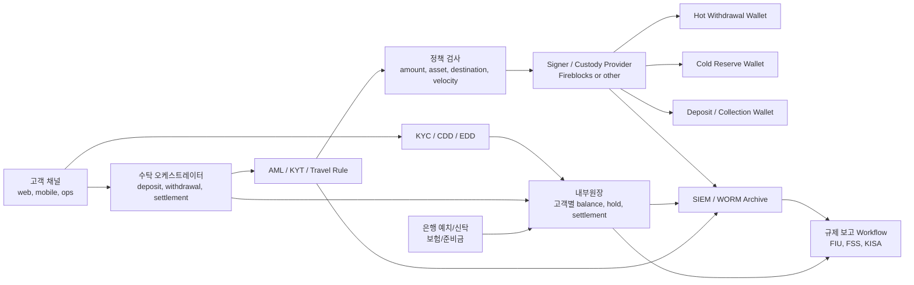
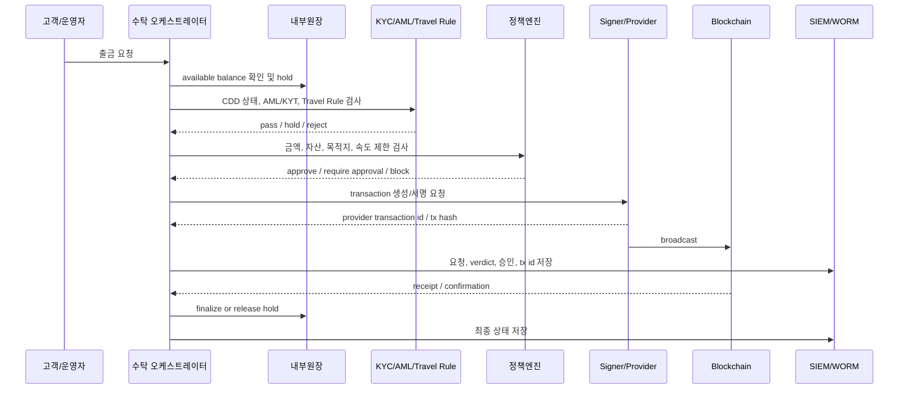

컴플라이언스는 지갑 시스템 옆에 붙는 보조 기능이 아닙니다.

출금이 서명되기 전에 반드시 통과해야 하는 gate입니다.

이 글은 국내 규제 요구사항을 수탁형 지갑 시스템 흐름에 넣는 아키텍처를 정리합니다.

## 권고 아키텍처



이 구조에서 signer/provider는 중간에 있습니다.

가장 앞에는 KYC/AML/정책 gate가 있고, 가장 뒤에는 증적과 보고 체계가 있습니다.

## 출금 compliance gate

출금 흐름은 아래처럼 직렬화되어야 합니다.



여기서 중요한 점은 signer 호출 전에 compliance verdict가 있어야 한다는 것입니다.

## 상태 분리

컴플라이언스 때문에 출금 상태는 단순하지 않습니다.

```mermaid
flowchart TB
  START([start])
  REQUESTED[REQUESTED]
  KYC_CHECK[KYC_CHECK]
  AML_CHECK[AML_CHECK]
  TRAVEL_RULE_CHECK[TRAVEL_RULE_CHECK]
  WAITING_FOR_TRAVEL_RULE[WAITING_FOR_TRAVEL_RULE]
  LEDGER_HOLD[LEDGER_HOLD]
  POLICY_CHECK[POLICY_CHECK]
  MANUAL_REVIEW[MANUAL_REVIEW]
  MANUAL_APPROVAL[MANUAL_APPROVAL]
  SUBMITTED_TO_PROVIDER[SUBMITTED_TO_PROVIDER]
  BROADCASTED[BROADCASTED]
  CONFIRMED[CONFIRMED]
  FINALIZED[FINALIZED]
  REJECTED[REJECTED]
  END([end])

  START --> REQUESTED
  REQUESTED --> KYC_CHECK
  KYC_CHECK -- "KYC pass" --> AML_CHECK
  KYC_CHECK -- "KYC fail" --> REJECTED
  AML_CHECK -- "AML pass" --> TRAVEL_RULE_CHECK
  AML_CHECK -- "AML hold" --> MANUAL_REVIEW
  TRAVEL_RULE_CHECK -- "required data ready" --> LEDGER_HOLD
  TRAVEL_RULE_CHECK -- "missing data" --> WAITING_FOR_TRAVEL_RULE
  LEDGER_HOLD --> POLICY_CHECK
  POLICY_CHECK -- "approved" --> SUBMITTED_TO_PROVIDER
  POLICY_CHECK -- "approval required" --> MANUAL_APPROVAL
  SUBMITTED_TO_PROVIDER --> BROADCASTED
  BROADCASTED --> CONFIRMED
  CONFIRMED --> FINALIZED
  MANUAL_REVIEW --> REJECTED
  MANUAL_APPROVAL --> SUBMITTED_TO_PROVIDER
  FINALIZED --> END
  REJECTED --> END
```



`MANUAL_REVIEW`와 `MANUAL_APPROVAL`은 다릅니다.

```text
MANUAL_REVIEW
-> AML/위험/규제 판단이 필요한 상태

MANUAL_APPROVAL
-> 정책상 추가 승인자가 필요한 상태
```

## evidence model

감사와 보고를 위해서는 transaction 하나를 재구성할 수 있어야 합니다.

필요한 증적입니다.

```text
withdrawal_request_id
user_id
KYC/CDD status
AML/KYT verdict
Travel Rule message id
ledger hold entry id
policy rule version
approval actor
provider transaction id
tx hash
receipt
final ledger entry id
webhook event id
operator action log
```

이 증적은 서로 다른 시스템에서 나옵니다.

따라서 공통 correlation id가 필요합니다.

```text
withdrawal_request_id
-> ledger
-> KYC/AML
-> Travel Rule
-> provider transaction
-> blockchain tx
-> archive
```

## 설계 원칙

```text
KYC/AML/Travel Rule은 signer 앞의 gate다.
ledger hold 없이 provider transaction을 만들지 않는다.
provider webhook은 event source이고, chain watcher와 reconciliation이 필요하다.
규제 보고는 운영 기능이 아니라 별도 workflow로 둔다.
모든 verdict와 승인 판단은 15년 보존 대상 후보로 본다.
```

## 추가 확인 필요

```text
Travel Rule provider를 어디로 둘 것인가?
KYC/CDD 상태를 출금 시스템이 어떤 API로 확인할 것인가?
AML hold 상태에서 ledger hold를 유지할 최대 기간은 얼마인가?
STR 후보가 된 출금을 자동 차단할지 수동 검토로 둘지 결정해야 한다.
provider transaction id와 내부 request id 매핑을 어디에 저장할 것인가?
```

## 참고 자료

- [특정 금융거래정보의 보고 및 이용 등에 관한 법률](https://law.go.kr/lsInfoP.do?lsId=009244)
- [FIU, 가상자산사업자 신고 관련 안내](https://www.kofiu.go.kr)
- [Fireblocks Developer Docs, Define Travel Rule Policies](https://developers.fireblocks.com/docs/define-travel-rule-policies)
- [Fireblocks Developer Docs, Define AML Policies](https://developers.fireblocks.com/docs/define-aml-policies)
- [Fireblocks API Reference, Webhooks V2](https://developers.fireblocks.com/api-reference/webhooks-v2/get-all-webhooks)
