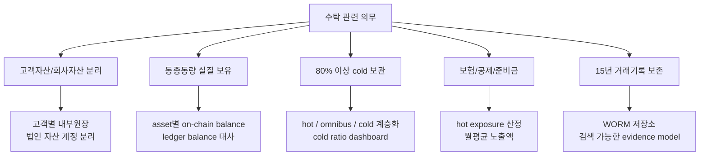
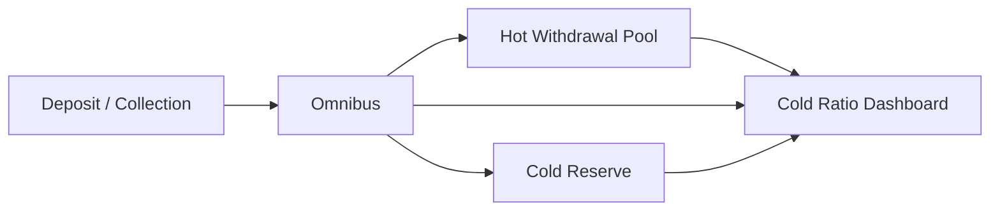
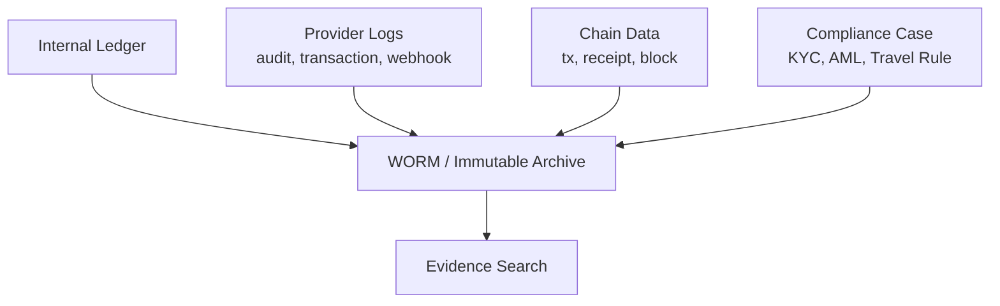

규제 문구는 기술 구현을 직접 설명하지 않습니다.

하지만 수탁형 지갑을 만드는 입장에서는 규제 요구사항을 시스템 요구사항으로 바꿔야 합니다.

이 글에서는 이용자 자산 보호 의무를 설계 언어로 번역합니다.

## 의무를 시스템 요구사항으로 바꾸기



핵심은 wallet만 나누는 것이 아닙니다.

wallet, ledger, reconciliation, evidence가 같이 설계되어야 합니다.

## 고객자산과 회사자산 분리

고객 자산과 회사 자산은 내부원장에서 분리되어야 합니다.

on-chain wallet 구조만으로는 충분하지 않습니다.

예를 들어 omnibus wallet을 쓰면 여러 고객의 자산이 하나의 주소에 섞일 수 있습니다.

이때 고객별 잔고의 기준은 내부원장입니다.

```text
on-chain omnibus balance
-> USDC 1,000,000

ledger
-> user A: USDC 100
-> user B: USDC 50
-> user C: USDC 10,000
-> company own asset: USDC 0 또는 별도 계정
```

설계 요구사항입니다.

```text
고객별 balance ledger
회사 자체자산 계정 분리
asset별 총량 대사
입금/출금/수수료/조정 entry 추적
operator manual adjustment 승인과 증적
```

## 동종동량 보유

동종동량 보유는 고객에게 빚진 자산과 실제 보유 자산의 종류와 수량이 맞아야 한다는 뜻으로 볼 수 있습니다.

시스템에서는 이렇게 대사합니다.

```text
ledger liability
-> 고객에게 지급해야 하는 자산 수량

on-chain custody balance
-> 실제 wallet들이 보유한 자산 수량

차이
-> mismatch
```

대사 단위는 최소한 아래를 포함해야 합니다.

```text
chain
asset
wallet tier
customer ledger total
company ledger total
on-chain balance total
pending deposit
pending withdrawal
fee reserve
reconciliation difference
```

pending 상태를 빼고 단순 잔고만 비교하면 오탐이 생깁니다.

## 80% 이상 cold wallet 보관

국내 규제 축에서는 고객 가상자산의 80% 이상을 cold wallet에 보관해야 하는 요구가 중요합니다.

기술 설계에서는 아래 질문으로 바뀝니다.

```text
어떤 wallet을 cold로 정의할 것인가?
hot / warm / cold tier를 어떻게 태깅할 것인가?
asset별 경제적 가치를 어떻게 환산할 것인가?
비율을 언제 계산할 것인가?
예외 상황을 어떻게 승인하고 기록할 것인가?
```

운영 구조 예시입니다.



hot wallet은 출금 처리량을 위해 필요합니다.

하지만 hot wallet에 너무 많은 자산을 두면 cold ratio와 사고 노출액 문제가 생깁니다.

따라서 withdrawal wallet pool은 운영 float만 가져야 합니다.

## 보험/공제/준비금과 hot exposure

hot wallet 노출분은 보험, 공제, 준비금 산정과 연결됩니다.

기술 시스템은 보험 계약을 대신할 수 없습니다.

하지만 노출액 산정 자료를 제공해야 합니다.

필요한 데이터입니다.

```text
wallet tier별 balance
asset price source
일별 원화 환산액
월평균 hot exposure
보험/준비금 기준액
계약/준비금 증빙 링크
```

이 값은 재무/컴플라이언스 시스템과 연결되어야 합니다.

## 15년 거래기록 보존

법정 기록보존 요구는 provider 로그만으로 끝나지 않습니다.

Fireblocks audit log, transaction history, webhook은 중요한 소스입니다.

하지만 15년 보존에는 별도 저장소가 필요합니다.



증적 모델은 나중에 감사자가 재현할 수 있어야 합니다.

```text
withdrawal id
ledger hold entry
KYC/AML verdict
Travel Rule message id
policy approval log
provider transaction id
tx hash
receipt
final ledger entry
operator action log
```

## 추가 확인 필요

```text
cold wallet 정의와 운영 방식이 감독 해석에 맞는가?
wallet tier 변경 절차와 승인 증적은 충분한가?
월평균 hot exposure 산식은 내부 재무 기준과 맞는가?
WORM 저장소가 15년 보존과 검색성을 충족하는가?
provider 로그 보존기간과 export API 제약은 무엇인가?
```

## 참고 자료

- [금융위원회, 가상자산이용자보호법 시행령 제정안 국무회의 통과](https://www.fsc.go.kr/no010101/82530)
- [Fireblocks Developer Docs, Object Model](https://developers.fireblocks.com/docs/object-model)
- [Fireblocks API Reference, Get audit logs](https://developers.fireblocks.com/api-reference/audit-logs/get-audit-logs)
- [KISA ISMS-P 인증기준 안내서](https://isms.kisa.or.kr/main/ispims/notice/?boardId=bbs_0000000000000014&cntId=21&mode=view)
