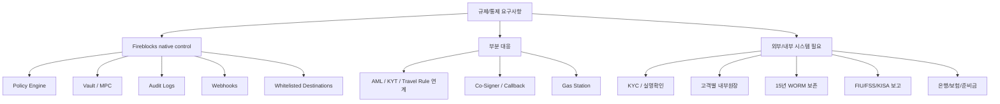

Fireblocks는 수탁형 지갑 인프라의 많은 기술 통제를 제공합니다.

하지만 Fireblocks를 사용한다고 국내 규제 준수가 자동으로 끝나는 것은 아닙니다.

이 글은 Fireblocks 기능을 규제/통제 요구사항에 매핑하되, 남는 책임 경계를 명확히 나눕니다.

## 먼저 경계부터 잡기



Fireblocks는 강한 signing/provider 계층입니다.

하지만 법적 책임과 운영 증적은 회사 시스템에서 닫아야 합니다.

## Fireblocks가 강하게 제공하는 통제

### Vault / MPC

Fireblocks Vault는 wallet과 address 관리, MPC 기반 서명 인프라를 제공합니다.

설계 의미입니다.

```text
고객별 vault account
용도별 vault account
hot withdrawal vault
cold reserve vault
deposit / collection vault
```

다만 법정 고객자산 분리 증명은 vault만으로 끝나지 않습니다.

내부원장과 대사가 필요합니다.

### Policy Engine

Fireblocks Policy Engine은 source, destination, asset, amount 같은 조건으로 transaction을 approve, block, 추가 승인 대상으로 만들 수 있습니다.

설계 의미입니다.

```text
금액별 승인자
목적지 whitelist
asset별 제한
운영 시간 제한
비상시 출금 차단
```

하지만 회사 인사권한표, 정책 변경 승인서, 예외 처리 티켓은 별도 증적으로 남겨야 합니다.

### Whitelisted Destination

목적지 주소 통제는 내부자 리스크와 오입금/오출금 위험을 줄이는 핵심 통제입니다.

운영 기본값은 whitelist-only가 안전합니다.

One Time Address 같은 예외 기능은 비상 절차와 승인 증적 없이 켜면 안 됩니다.

### Audit Logs / Webhooks

Audit Logs와 Webhooks는 좋은 event source입니다.

하지만 장기 보존 저장소 자체는 아닙니다.

```text
Fireblocks Audit Logs
-> SIEM
-> WORM archive
-> evidence search
```

## 부분 대응 통제

### AML / KYT / Travel Rule

Fireblocks는 AML/KYT provider 연계와 Travel Rule 관련 API를 제공합니다.

하지만 국내 KYC 본인확인, CDD/EDD, STR 판단, Travel Rule 메시지 운영 책임은 별도입니다.

설계에서는 이렇게 연결합니다.

```text
KYC system
-> customer id / CDD status

AML/KYT engine
-> address risk / transaction risk

Travel Rule system
-> originator / beneficiary data

Fireblocks transaction
-> customerRefId / travelRuleMessageId / policy result
```

### Co-Signer / Callback

Co-Signer와 Callback Handler는 내부 정책을 서명 직전에 강제할 수 있는 좋은 위치입니다.

예를 들어:

```text
KYC incomplete
-> reject

AML hold
-> reject or manual review

Travel Rule missing
-> reject

withdrawal limit exceeded
-> require approval
```

하지만 callback 서버의 보안, HA, 네트워크 분리, 로그 보존은 회사 책임입니다.

### Gas Station

Gas Station은 EVM gas funding을 자동화할 수 있습니다.

하지만 gas 부족 상태, funding 실패, chain별 gas threshold, 비용 회계 처리는 별도 운영 로직이 필요합니다.

## 플랫폼 밖에 남는 통제

Fireblocks 밖에서 반드시 설계해야 하는 것들입니다.

| 통제 | 왜 Fireblocks만으로 부족한가 | 필요한 시스템 |
|---|---|---|
| KYC / 실명확인 | Fireblocks는 신원확인 시스템이 아니다 | eKYC, 계좌/서류 확인, CDD/EDD |
| 고객별 내부원장 | Vault balance는 고객별 법적 잔고가 아니다 | double-entry ledger |
| 15년 기록보존 | provider 로그 보존과 법정 보존은 다르다 | SIEM, WORM archive, evidence model |
| STR / 감독 보고 | 탐지와 제출 책임은 다르다 | AML case management, report workflow |
| 은행 예치/신탁 | 고객 현금성 예치금은 지갑 플랫폼 밖이다 | 은행/재무 대사 시스템 |
| 보험/준비금 | 계약/준비금은 재무 통제다 | exposure 산정, 보험/준비금 증빙 |
| 망분리/운영망 | provider 기능이 회사 인프라 보안을 대체하지 않는다 | IAM, network segmentation, bastion |

## 설계 원칙

```text
Fireblocks native 기능은 적극 활용한다.
하지만 규제 준수 완료로 오해하지 않는다.
고객 잔고의 기준은 내부원장이다.
출금 허가의 기준은 KYC/AML/Travel Rule/policy verdict다.
감사 증적의 기준은 외부 장기보존 저장소다.
```

## 추가 확인 필요

```text
우리가 사용할 Fireblocks 기능 중 beta 기능이 있는가?
Policy API와 Console 정책 변경 증적을 어떻게 수집할 것인가?
Co-Signer HA 구성이 국내 보안점검 범위에 어떻게 들어가는가?
Travel Rule provider를 Fireblocks TRLink로 할지 외부 시스템으로 할지 결정해야 하는가?
Audit Logs API 보존기간과 export 제약은 무엇인가?
```

## 참고 자료

- [Fireblocks Developer Docs, What Is Fireblocks](https://developers.fireblocks.com/docs/what-is-fireblocks)
- [Fireblocks Developer Docs, Object Model](https://developers.fireblocks.com/docs/object-model)
- [Fireblocks API Reference, Get audit logs](https://developers.fireblocks.com/api-reference/audit-logs/get-audit-logs)
- [Fireblocks API Reference, Webhooks V2](https://developers.fireblocks.com/api-reference/webhooks-v2/get-all-webhooks)
- [Fireblocks Developer Docs, Define Travel Rule Policies](https://developers.fireblocks.com/docs/define-travel-rule-policies)
