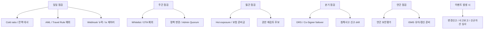
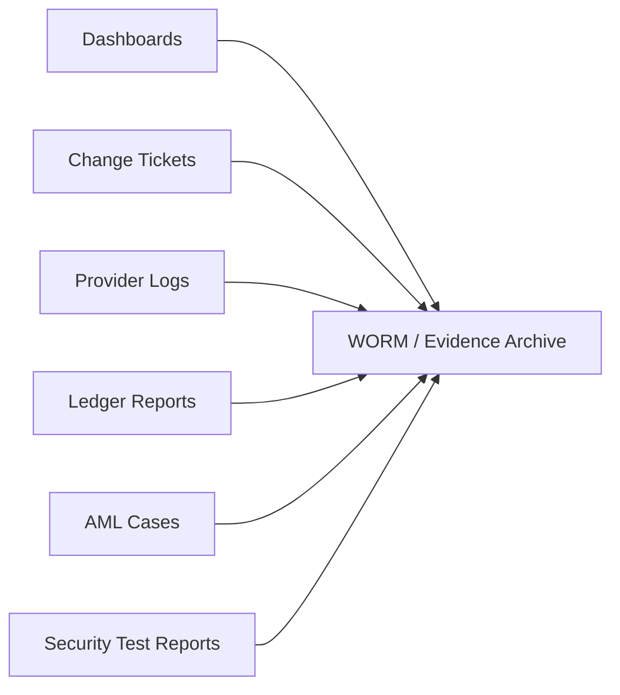

규제 대응은 한 번 설정하고 끝나는 일이 아닙니다.

프로덕션에서는 점검 주기가 있어야 합니다.

이 글은 운영자가 무엇을 보고, 어떤 증적을 남겨야 하는지 정리합니다.

## 점검 주기 지도



## 일일 점검

일일 점검은 자산과 거래의 정합성을 봅니다.

| 점검 항목 | 봐야 할 값 | 남길 증적 |
|---|---|---|
| cold ratio | 고객 가상자산 중 cold wallet 보관 비율 | daily cold ratio snapshot |
| 고객별 잔액 대사 | ledger liability vs on-chain custody balance | reconciliation report |
| KYC 미완료 출금 차단 | blocked withdrawal count | blocked request log |
| AML/KYT hold | hold case count, oldest case age | case queue export |
| Travel Rule 예외 | missing data, message failure | travel rule message id |
| webhook 누락 | provider event vs watcher event 차이 | reconciliation diff |

일일 점검은 dashboard만 보면 부족합니다.

나중에 감사자가 볼 수 있는 snapshot과 report가 필요합니다.

## 주간 점검

주간 점검은 변경과 예외를 봅니다.

```text
whitelist destination 추가/삭제
One Time Address 예외 사용
정책 변경
Admin Quorum 변경
privileged user 권한 변경
API IP allowlist 변경
```

모든 변경은 아래와 연결되어야 합니다.

```text
ticket id
승인자
변경 전/후 diff
적용 시간
rollback 가능 여부
```

## 월간 점검

월간 점검은 재무/보험/준비금과 연결됩니다.

```text
hot wallet 월평균 노출액
asset별 원화 환산 기준
보험/공제 보상 한도
준비금 잔액
예치금/신탁 대사
```

이 값은 지갑 시스템만으로 끝나지 않습니다.

재무 시스템과 계약 증빙이 필요합니다.

## 분기 점검

분기 점검은 복구 능력을 봅니다.

```text
DRS 복구 리허설
Co-Signer failover
RPC provider 장애 전환
webhook replay
ledger reconciliation backfill
침해사고 24시간 신고 drill
```

실제로 해보지 않은 runbook은 장애 때 작동한다고 보기 어렵습니다.

## 연간 점검

연간 점검은 외부 평가와 인증 대응입니다.

```text
승인기관 보안평가
ISMS 유지/갱신 준비
침투테스트
취약점 조치 결과
접근권한 재인증
정책/절차서 업데이트
```

연간 점검은 1년 뒤에 준비하면 늦습니다.

일일/주간/월간 증적이 쌓여 있어야 연간 평가가 가능합니다.

## 이벤트 발생 시

이벤트성 점검은 평소보다 더 중요할 수 있습니다.

```text
신규 chain 지원
신규 asset 상장
custody provider 변경
Co-Signer 인프라 변경
운영망 구조 변경
대형 incident 발생
신고사항 변경 가능성
```

신규 asset 하나도 지갑 주소 모델, gas, Travel Rule, AML/KYT, cold ratio 계산에 영향을 줄 수 있습니다.

## 운영 증적 저장소

운영 증적은 흩어져 있으면 안 됩니다.



증적은 나중에 검색 가능해야 합니다.

```text
기간
사용자
asset
wallet
transaction id
policy version
operator
case id
```

## 추가 확인 필요

```text
우리 조직의 보안평가 주기는 어떻게 잡을 것인가?
외부 평가기관이 요구하는 증적 형식은 무엇인가?
SIEM과 WORM 저장소를 어떤 제품으로 둘 것인가?
운영 dashboard snapshot을 자동 저장할 것인가?
Travel Rule message와 내부 withdrawal id를 어떻게 연결할 것인가?
```

## 참고 자료

- [금융위원회, 가상자산이용자보호법 시행령 제정안 국무회의 통과](https://www.fsc.go.kr/no010101/82530)
- [KISA ISMS-P 인증기준 안내서](https://isms.kisa.or.kr/main/ispims/notice/?boardId=bbs_0000000000000014&cntId=21&mode=view)
- [KISA ISMS-P 자료실, 가상자산사업자용 세부점검항목](https://isms.kisa.or.kr/main/ispims/notice/?boardId=bbs_0000000000000014&cntId=19&mode=view)
- [Fireblocks API Reference, Get audit logs](https://developers.fireblocks.com/api-reference/audit-logs/get-audit-logs)
- [Fireblocks API Reference, Webhooks V2](https://developers.fireblocks.com/api-reference/webhooks-v2/get-all-webhooks)
