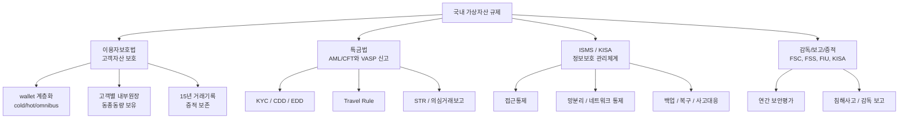
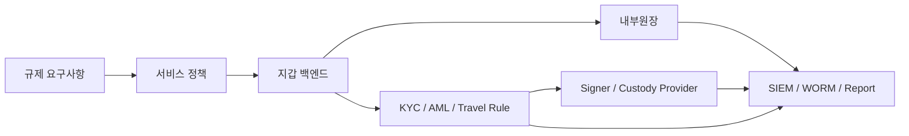

이 글은 국내 가상자산 규제를 외우기 위한 문서가 아닙니다.

수탁형 지갑 인프라를 설계할 때 어떤 규제 축을 놓치면 안 되는지 지도로 잡는 글입니다.

법률 의견이 아니라 기술 설계를 위한 학습 노트입니다.

## 큰 그림

국내 수탁형 가상자산 사업자에게 중요한 축은 크게 네 가지입니다.



수탁형 지갑 설계는 blockchain transaction만 다루지 않습니다.

국내 규제 관점에서는 아래가 모두 하나의 시스템 경계로 이어집니다.

```text
고객 자산 보관
-> 내부원장
-> KYC/AML
-> 출금 승인
-> 서명 인프라
-> 장기 증적 보존
-> 감독기관 대응
```

## 이용자보호법 축

가상자산 이용자 보호 등에 관한 법률은 이용자 예치금과 가상자산 보호, 불공정거래 대응, 감독/검사/제재권한을 다룹니다.

수탁형 지갑 설계에서 바로 영향을 주는 것은 고객자산 보호입니다.

핵심 설계 질문은 아래입니다.

```text
고객 자산과 회사 자산이 분리되어 있는가?
고객이 위탁한 자산과 같은 종류/수량을 실제로 보유하는가?
고객 가상자산의 80% 이상을 cold wallet에 둘 수 있는가?
hot wallet 노출분을 보험/공제/준비금 산정에 연결할 수 있는가?
거래기록을 15년 동안 추적 가능하게 보존할 수 있는가?
```

이 축은 wallet 구조와 내부원장 구조를 강제합니다.

## 특금법 축

[특정 금융거래정보의 보고 및 이용 등에 관한 법률](https://law.go.kr/lsInfoP.do?lsId=009244)은 VASP 신고와 AML/CFT 의무를 다룹니다.

수탁형 지갑 설계에서는 출금 전에 KYC와 AML verdict가 반드시 들어와야 합니다.

```text
KYC 미완료
-> 출금 불가

AML/KYT 보류
-> 자동 출금 불가

Travel Rule 대상
-> 송수신인 정보와 message id 필요

의심거래 후보
-> case management와 STR 판단 필요
```

즉 출금 파이프라인은 signer/provider 앞에서 compliance gate를 통과해야 합니다.

## ISMS/KISA 축

VASP 신고와 운영에는 ISMS 계열 준비가 중요합니다.

기술 설계에서는 아래 항목이 직접 연결됩니다.

```text
접근권한 관리
운영망/관리망/서비스망 분리
API key와 secret 관리
감사로그
변경관리
백업과 복구
침해사고 대응
외부자/위탁업체 통제
```

Fireblocks나 다른 custody provider를 사용해도 이 책임은 사라지지 않습니다.

provider는 지갑/서명/정책 기능을 제공할 수 있지만, 회사의 운영망, IAM, SIEM, 사고보고 체계는 별도입니다.

## 설계 관점의 계층

규제를 시스템 계층으로 바꾸면 아래처럼 볼 수 있습니다.



설계 판단의 기준은 이것입니다.

```text
규제 요구사항을 API 호출 하나로 해결하려 하지 않는다.
기능을 제공하는 provider와 법적 책임을 지는 사업자 경계를 구분한다.
모든 통제는 증적으로 남겨야 한다.
```

## 추가 확인 필요

아래는 구현 전에 다시 확인해야 합니다.

```text
우리 서비스가 정확히 어떤 VASP 유형에 해당하는가?
원화 예치금을 다루는가?
실명확인 입출금계정 요건이 필요한 영업모델인가?
Travel Rule 적용 대상 전송을 처리하는가?
외부 provider 사용이 업무위탁/중요업무 위탁으로 해석될 수 있는가?
```

## 참고 자료

- [금융위원회, 가상자산이용자보호법 시행령 제정안 국무회의 통과](https://www.fsc.go.kr/no010101/82530)
- [특정 금융거래정보의 보고 및 이용 등에 관한 법률](https://law.go.kr/lsInfoP.do?lsId=009244)
- [KISA ISMS-P 제도소개](https://isms.kisa.or.kr/main/ispims/intro/) 및 [KISA ISMS-P 자료실, 가상자산사업자용 세부점검항목](https://isms.kisa.or.kr/main/ispims/notice/?boardId=bbs_0000000000000014&cntId=19&mode=view)
- [Fireblocks Developer Docs](https://developers.fireblocks.com/docs/introduction)
