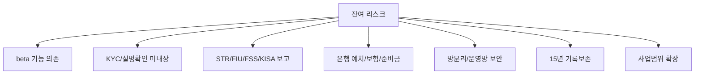

수탁형 지갑 설계에서 위험한 착각은 provider가 모든 규제 대응을 끝내준다고 보는 것입니다.

Fireblocks 같은 provider는 중요한 기술 통제를 제공합니다.

하지만 국내 VASP의 법적/운영 책임은 여전히 사업자에게 남습니다.

이 글은 플랫폼을 써도 남는 리스크를 정리합니다.

## 잔여 리스크 지도



## beta 기능 의존

provider 문서에서 beta로 표시된 기능을 법정 필수통제의 핵심으로 쓰면 위험합니다.

리스크입니다.

```text
API 변경
지원 범위 불명확
감사 시 안정성 설명 어려움
장애 대응 SLA 불확실
```

완화 방향입니다.

```text
필수통제는 GA 기능으로 설계한다.
beta 기능은 보조 자동화로 둔다.
계약상 지원 범위와 release note를 확인한다.
beta 의존 항목은 별도 risk register에 올린다.
```

## KYC / 실명확인 미내장

Fireblocks는 지갑/서명/provider 계층이지 국내 KYC 시스템이 아닙니다.

KYC/CDD/EDD는 별도 시스템이 필요합니다.

```text
신분증/법인문서 확인
실명확인
고객위험평가
EDD
제재/PEP screening
CDD 완료 전 거래 제한
```

출금 시스템은 KYC 시스템의 상태를 강제해야 합니다.

```text
KYC incomplete
-> withdrawal blocked

EDD required
-> manual review

sanctions match
-> reject / report workflow
```

## STR / 감독기관 보고

AML/KYT가 위험 신호를 줄 수는 있습니다.

하지만 STR 판단과 FIU 보고는 내부 AML 조직과 프로세스가 필요합니다.

또 침해사고나 감독 보고는 보안/법무/컴플라이언스 체계가 필요합니다.

완화 방향입니다.

```text
case management system
STR decision workflow
보고 템플릿
24시간 incident report runbook
on-call 책임자
증적 archive
```

## 은행 예치/보험/준비금

지갑 시스템은 가상자산을 다룹니다.

하지만 국내 규제에는 고객 예치금, 보험/공제, 준비금 같은 외부 계약/재무 통제가 있습니다.

리스크입니다.

```text
은행 예치/신탁 대사 누락
hot exposure 산정 오류
보험/준비금 기준 미달
재무 증빙과 wallet dashboard 불일치
```

완화 방향입니다.

```text
daily fiat reconciliation
monthly hot exposure report
보험/준비금 증빙 관리
wallet tier별 balance snapshot
finance system 연계
```

## 망분리와 운영 인프라

Co-Signer나 callback server를 회사 환경에 배치하면 그 인프라의 보안 수준이 곧 통제 수준이 됩니다.

provider 기능만으로 운영망 보안이 해결되지 않습니다.

확인할 항목입니다.

```text
운영망/관리망/서비스망 분리
bastion 접근
MFA
break-glass account
API key storage
IP allowlist
host hardening
patch management
```

## 15년 기록보존

provider 로그는 evidence source입니다.

하지만 법정 장기보존 저장소 자체가 아닐 수 있습니다.

필요한 구조입니다.

```text
provider audit logs
provider transaction history
webhook events
internal ledger entries
KYC/AML verdict
Travel Rule messages
operator approvals
chain receipts
```

이 모든 것을 correlation id로 묶어 WORM 성격의 저장소에 보관해야 합니다.

## 사업범위 확장 리스크

처음에는 단순 수탁/출금만 하더라도 나중에 기능이 늘어날 수 있습니다.

```text
원화 입출금
법인 고객
스테이킹
대여
OTC
해외 VASP 전송
신규 chain
```

사업범위가 바뀌면 규제 해석과 시스템 요구사항도 바뀝니다.

따라서 신규 기능은 product decision이 아니라 regulatory architecture decision으로 봐야 합니다.

## 리스크 관리 원칙

```text
provider 기능은 통제 수단이지 준수 완료가 아니다.
남는 책임을 명시적으로 owner에게 배정한다.
모든 예외는 ticket과 evidence로 남긴다.
법정 의무와 기술 기능 사이에 control matrix를 둔다.
확실하지 않은 항목은 추가 확인 필요로 남긴다.
```

## 추가 확인 필요

```text
provider 계약서/SLA에서 감사 지원 범위는 어디까지인가?
Fireblocks beta 기능 의존 항목이 있는가?
KYC/AML vendor와 Fireblocks customerRefId 매핑 방식은 무엇인가?
WORM archive 제품과 보존 정책은 무엇인가?
침해사고 보고 책임자와 백업 책임자는 누구인가?
```

## 참고 자료

- [금융위원회, 가상자산이용자보호법 시행령 제정안 국무회의 통과](https://www.fsc.go.kr/no010101/82530)
- [KISA ISMS-P 인증기준 안내서](https://isms.kisa.or.kr/main/ispims/notice/?boardId=bbs_0000000000000014&cntId=21&mode=view)
- [Fireblocks Developer Docs, What Is Fireblocks](https://developers.fireblocks.com/docs/what-is-fireblocks)
- [Fireblocks API Reference, Get audit logs](https://developers.fireblocks.com/api-reference/audit-logs/get-audit-logs)
- [Fireblocks Developer Docs, API Co-Signers Architecture Overview](https://developers.fireblocks.com/docs/cosigner-architecture-overview)
